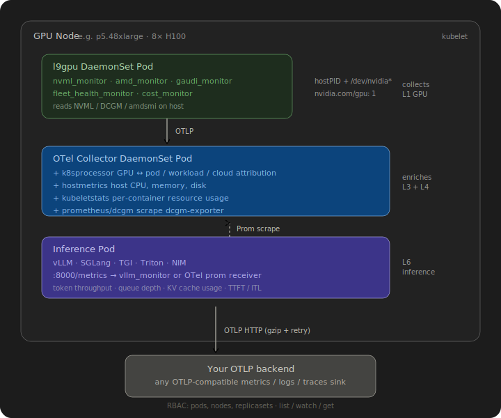

# l9gpu Architecture — How It Works

Last9 GPU Telemetry (l9gpu) is a vendor-agnostic GPU and LLM observability stack. This document covers the end-to-end data flow, every component, and how they connect.

---

## System Overview


---

## Component Details

### 1. Python Collectors

**What they are:** Lightweight metric scrapers that run as a DaemonSet on every GPU node. Each collector is a CLI subcommand of the `l9gpu` binary.

**How they collect data:**

| Collector | Data Source | Method | Interval |
|-----------|------------|--------|----------|
| `nvml_monitor` | NVIDIA NVML library | Direct Python API (`pynvml`) | 60s |
| `amd_monitor` | AMD System Management Interface | Direct Python API (`amdsmi`) | 60s |
| `gaudi_monitor` | Intel Habana `hl-smi` | CLI subprocess + CSV parse | 60s |
| `dcgm_monitor` | DCGM Exporter Prometheus | HTTP scrape `:9400/metrics` | 60s |
| `vllm_monitor` | vLLM Prometheus endpoint | HTTP scrape `:8000/metrics` | 30s |
| `nim_monitor` | NVIDIA NIM Prometheus | HTTP scrape `:8000/metrics` | 30s |
| `triton_monitor` | Triton Inference Server | HTTP scrape `:8002/metrics` | 30s |
| `sglang_monitor` | SGLang Prometheus | HTTP scrape `:30000/metrics` | 30s |
| `tgi_monitor` | HuggingFace TGI Prometheus | HTTP scrape `:8080/metrics` | 30s |
| `fleet_health_monitor` | NVML (sliding window analysis) | Direct API + computation | 60s |
| `cost_monitor` | NVML + EC2 metadata + vLLM | Direct API + HTTP | 60s |
| `nccl_monitor` | NCCL Inspector JSON logs | File tail + parse | 30s |

**Internal libraries used:**
- `prometheus.py` — Lightweight Prometheus text format parser (regex-based, no external dependency). Parses counter, gauge, and histogram metrics. Includes `histogram_quantile()` implementing the same linear-interpolation algorithm as Prometheus.
- `device_telemetry_client.py` — Protocol (Python `Protocol` class) defining the GPU device interface. Implementations: `NVMLGPUDevice`, `AMDGPUDevice`, `GaudiGPUDevice`.
- `metric_names.py` — Central registry mapping 204 Python field names to OTel metric names, 196 units, 96 disambiguating attributes.

**Sink abstraction:** All collectors use the same `SinkImpl` protocol to write data. Available sinks:

| Sink | Use Case | Output |
|------|----------|--------|
| `otel` | Production | OTLP binary to configured endpoint (60s periodic export) |
| `stdout` | Debugging | JSON to terminal |
| `file` | Local capture | Append to `metrics.jsonl` |
| `webhook` | Custom integration | HTTP POST to configured URL |

### 2. Schema Layer

Every metric passes through a typed Python dataclass before export. This enforces structure and enables IDE completion.

| Schema | Fields | What It Represents |
|--------|--------|--------------------|
| `DeviceMetrics` | 65 | Base GPU hardware (NVIDIA/AMD/Gaudi) |
| `DcgmProfilingMetrics` | 16 | DCGM profiling (SM, tensor core, NVLink, MIG) |
| `VllmMetrics` | 24 | vLLM inference (throughput, latency, cache, spec decode, LoRA) |
| `NimMetrics` | 9 | NVIDIA NIM inference |
| `TritonMetrics` | 11 | Triton per-model metrics |
| `SGLangMetrics` | 18 | SGLang inference |
| `TGIMetrics` | 20 | HuggingFace TGI inference |
| `GPUFleetHealthMetrics` | 13 | XID rate, ECC trends, health score |
| `GPUCostMetrics` | 13 | Cost/token, idle cost, carbon |
| `NCCLCollectiveMetrics` | 7 | Collective bandwidth, straggler detection |
| `TrainingMetrics` | 11 | MFU, gradient health, checkpoint I/O |

### 3. Metric Name Normalization

Raw field names from different vendors are normalized to a canonical OTel namespace before export.

**Example transformations:**

| Python Field | OTel Metric Name | Unit | Disambiguating Attributes |
|---|---|---|---|
| `gpu_util` | `gpu.utilization` | `1` | `gpu.task.type=compute` |
| `temperature` | `gpu.temperature` | `Cel` | `gpu.temperature.sensor=edge` |
| `nvlink_tx_bandwidth` | `gpu.interconnect.throughput` | `By/s` | `gpu.interconnect.type=nvlink, direction=transmit` |
| `itl_p95` | `vllm.itl` | `s` | `quantile=p95` |
| `cost_per_gpu_hour` | `gpu.cost.per_gpu_hour` | `USD/h` | — |

**GenAI OTel conventions** (opt-in via `--emit-genai-namespace`): inference metrics are also emitted under `gen_ai.*` names per the OpenTelemetry GenAI specification. Both namespaces are emitted simultaneously — no dashboard breakage.

### 4. OTel Exporter (otel.py)

The core export path:

```
Collector loop
  → scrape/collect metrics
  → populate typed dataclass (e.g. VllmMetrics)
  → pass to SinkImpl.write(Log, SinkAdditionalParams)
  → OTel exporter iterates dataclass fields:
      → skip None, skip strings, skip identity fields
      → look up OTel name: get_otel_name(field_name)
      → look up unit: get_unit(field_name)
      → look up attributes: get_data_point_attributes(field_name)
      → inject GPU identity (gpu.index, gpu.uuid, gpu.model)
      → inject model identity (model.name, model.version) for inference metrics
      → inject MIG identity (gpu.mig.enabled, gpu.mig.instance_id)
      → inject NCCL identity (nccl.collective.type, nccl.rank)
      → gauge.set(value, attributes)
      → if emit_genai: also emit under gen_ai.* name
  → PeriodicExportingMetricReader flushes to OTLP endpoint every 60s
```

**Wire protocol:** OTLP over HTTP with binary protobuf encoding. Configurable endpoint via `OTEL_EXPORTER_OTLP_ENDPOINT` environment variable.

### 5. K8s Processor (Go)

**What it is:** A custom OpenTelemetry Collector processor plugin written in Go. It enriches GPU metrics with Kubernetes pod metadata — the critical link between "GPU 3 is at 95% utilization" and "that's the llama-70b inference pod in namespace production."

**How it works:**

```
Incoming metric (with gpu.index=3 attribute)
  │
  ▼
k8shelper.GetGPU2K8s(config)
  │ Query K8s API: pods on this node requesting GPU resources
  │ Count GPU requests per container: nvidia.com/gpu, amd.com/gpu, habana.ai/gaudi
  │ Assign sequential GPU ordinals to pods
  │ Cache result for 60 seconds
  │
  ▼
Match gpu.index=3 to pod metadata
  │
  ▼
Inject attributes:
  k8s.pod.name = "llama-70b-serving-abc123"
  k8s.namespace.name = "production"
  k8s.deployment.name = "llama-70b-serving"
  cloud.availability_zone = "us-east-1a"
  k8s.pod.label.app = "llama-inference"
```

**RBAC:** Requires `ClusterRole` with `pods:list` permission. Helm chart creates this automatically.

**Supports:** Metrics, logs, and traces (all signal types enriched with the same pod metadata).

### 6. OTel Collector Pipeline

Shipped as a Helm ConfigMap (`otel-collector-config.yaml`). Configures a full telemetry pipeline:

**Receivers (data sources):**

| Receiver | What It Collects | Layer |
|----------|-----------------|-------|
| `otlp` (gRPC + HTTP) | Metrics from l9gpu monitors, traces from xpu-perf | L1, L2, L5-L8 |
| `prometheus/dcgm` | DCGM Exporter metrics (`:9400`) | L1 |
| `prometheus/vllm` | vLLM inference metrics | L6 |
| `prometheus/triton` | Triton inference metrics | L6 |
| `hostmetrics` | CPU, memory, disk, network (30s) | L3 |
| `kubeletstats` | Container CPU, memory, OOM kills (30s) | L4 |
| `k8s_cluster` | Pod lifecycle, scheduling (60s) | L4 |

**Processors (transformations):**

| Processor | What It Does |
|-----------|--------------|
| `memory_limiter` | Prevents collector OOM (80% limit, 25% spike) |
| `k8sprocessor` | GPU-to-pod metadata enrichment (Go plugin) |
| `resource/gpu_labels` | Inject cluster name and service name |
| `filter/drop_noisy` | Drop `go_*`, `python_*`, `*_created` metrics |
| `batch` | Batch 1000 data points with 10s timeout |

**Exporters:**

| Exporter | Destination |
|----------|-------------|
| `otlphttp` | Your backend (configurable, gzip compressed, retry on failure) |
| `debug` | Local stdout (for troubleshooting) |

### 7. Training Library (l9gpu.training)

A Python library that users import into their PyTorch training scripts. Not a CLI monitor — it runs inside the training process.

```python
from l9gpu.training import L9GPUTrainingMonitor

monitor = L9GPUTrainingMonitor(
    otlp_endpoint="http://otel-collector:4317",
    num_params=70_000_000_000,
    tokens_per_step=4096,
    gpu_count=8,
    peak_tflops_per_gpu=989.0,  # H100 BF16
)
```

**Components:**
- `mfu.py` — MFU calculator using the PaLM paper formula: `6 × N × T / (step_time × GPUs × peak_TFLOPS)`. Includes a GPU peak TFLOPS lookup table (H100, A100, L4, B200, T4, V100).
- `hooks.py` — `GradientTracker` (L2 norm, NaN detection, clip rate), `DataLoaderTimer` (measures time waiting for next batch), `CheckpointTimer` (context managers for save/restore duration + bandwidth).
- Exports via OTel gRPC with 30-second periodic flush.

---

## Deployment Topology

### Kubernetes

<p align="center">
  
</p>

### Helm Chart Configuration

Single `values.yaml` controls everything:

```yaml
# Which GPU vendor to collect from
collectors:
  nvidia: true
  amd: false
  gaudi: false

# Which inference engines to monitor
collectors:
  vllm: true
  triton: false
  sglang: false
  tgi: false

# Fleet health + cost (optional)
fleetHealth:
  enabled: true
costMonitor:
  enabled: false
  costPerGpuHour: 6.88  # or auto-detect from EC2

# OTel Collector pipeline
otelCollector:
  enabled: true
  otlpEndpoint: "https://otel-collector.example.com/v1"

# Slurm (optional — disable for pure K8s)
monitoring:
  slurmEnabled: false

# RBAC for GPU→pod mapping
rbac:
  create: true
```

---

## External Dependencies

### Python (production)

| Library | Version | Purpose |
|---------|---------|---------|
| `opentelemetry-sdk` | 1.40 | OTel metrics + logs SDK |
| `opentelemetry-exporter-otlp` | 1.40 | OTLP HTTP/gRPC export |
| `pynvml` | 11.4 | NVIDIA GPU API |
| `requests` | 2.27 | Prometheus HTTP scraping |
| `click` | 8.0 | CLI framework |
| `omegaconf` | 2.2 | Configuration |
| `psutil` | latest | Host metrics (RAM utilization) |
| `amdsmi` | optional | AMD GPU API |

### Go (k8sprocessor)

| Library | Version | Purpose |
|---------|---------|---------|
| `k8s.io/client-go` | 0.32 | K8s API client |
| `go.opentelemetry.io/collector` | 1.32 | OTel Collector SDK |

### No external agents required

l9gpu does not require installing DCGM, Prometheus, or any external agent. It talks directly to GPU APIs. The OTel Collector and DCGM Exporter are optional components that add L3/L4 coverage and higher-precision DCGM profiling metrics.

---

## Metric Counts

| Category | Count |
|----------|-------|
| OTel metric name mappings | 204 |
| UCUM unit definitions | 196 |
| Data-point attribute rules | 96 |
| Schema fields (total) | 229 |
| CLI commands | 25 |
| Inference engines supported | 5 (vLLM, NIM, Triton, SGLang, TGI) |
| GPU vendors supported | 3 (NVIDIA, AMD, Intel Gaudi) |
| Test cases | 38 (92% coverage on new code) |
