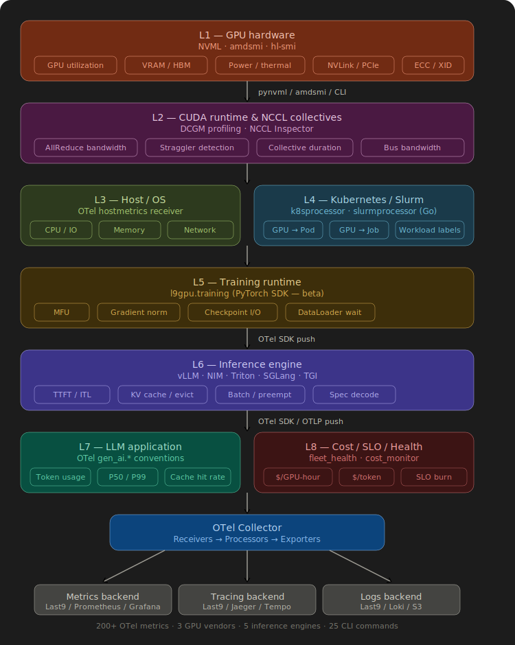

# GPU & LLM Inference Observability — Layer-by-Layer Coverage

Last9 GPU Telemetry (l9gpu) provides full-stack observability across 8 layers, from silicon to business metrics. Vendor-agnostic. NVIDIA, AMD, Intel Gaudi. Kubernetes and Slurm. Every major inference engine.



---

## L1 — GPU Hardware & Silicon

> What's happening inside each GPU right now?

**Sources:** NVML API (NVIDIA), amdsmi (AMD), hl-smi (Intel Gaudi), DCGM Exporter

| Category | Metrics | Why It Matters |
|----------|---------|----------------|
| **Compute** | GPU utilization, SM active ratio, SM occupancy, tensor core activity, FP16/FP32/FP64 pipe activity | Distinguish between "GPU busy" and "GPU doing useful work" — utilization alone is misleading |
| **Memory** | VRAM used/free/total, HBM bandwidth saturation, memory controller utilization | Catch OOM before it crashes your job. Know when HBM bandwidth is the bottleneck |
| **Interconnect** | NVLink TX/RX throughput, PCIe TX/RX throughput, XGMI per-link bandwidth (AMD), per-port RoCE bandwidth (Gaudi) | Multi-GPU bottleneck detection. Is NCCL limited by NVLink or PCIe? |
| **Power & Thermal** | Power draw (W), temperature (edge/junction/HBM), clock frequency, throttle reasons, fan speed, energy consumption (mJ) | Detect thermal throttling before it impacts latency. Energy attribution for cost and carbon |
| **Reliability** | ECC errors (correctable/uncorrectable), XID errors, retired pages, row remapping, PCIe replay counter | Silent degradation detection. ECC trends predict failure 48-72 hours ahead |

**Fleet Health Signals (derived from L1):**

| Signal | What It Detects | Alert Threshold |
|--------|-----------------|-----------------|
| `gpu.health.score` (0-100) | Composite: ECC + XID + thermal + PCIe | Warning < 80, Critical < 50 |
| `gpu.ecc.sbe_rate` | Single-bit error rate trending up | > 10/hour |
| `gpu.xid.error_rate` | XID event frequency (XID 79 = GPU fell off bus) | > 0/hour |
| `gpu.pcie.link.downtraining` | PCIe Gen5 x16 → Gen3 x8 (massive bandwidth loss) | Any occurrence |
| `gpu.thermal.ramp_rate` | Temperature rising > 2 C/min (cooling failure) | > 2.0 C/min |

**MIG Support:** Per-MIG-instance metrics with `gpu.mig.instance_id` attribution. Automatic fallback to `GR_ENGINE_ACTIVE` when standard utilization returns 0 on MIG-enabled GPUs.

**Unified Memory (GH200/GB200):** Automatic detection and reporting of unified CPU+GPU memory pools on Grace-Hopper and Grace-Blackwell architectures.

---

## L2 — CUDA Runtime & Collective Communication

> What are the GPUs actually executing? Where is multi-GPU communication stuck?

**Sources:** NCCL Inspector (production-ready log parser), xpu-perf eBPF+CUPTI profiler

| Category | Metrics | Why It Matters |
|----------|---------|----------------|
| **NCCL Collectives** | AllReduce/AllGather/ReduceScatter bandwidth, bus bandwidth, duration, message size | Is distributed training limited by communication? Which collective is the bottleneck? |
| **Straggler Detection** | Per-rank duration vs median. Flag if rank > 1s behind | One slow GPU drags down the entire training job |
| **CUDA Kernels** | Per-kernel execution time, call count, p99 duration | Which kernels dominate GPU time? Trace-level profiling via OTel spans |

---

## L3 — Host / OS / System

> Is the host the bottleneck, not the GPU?

**Sources:** OTel Collector `hostmetrics` receiver (shipped as Helm ConfigMap)

| Category | Metrics | Why It Matters |
|----------|---------|----------------|
| **CPU** | Utilization per core, I/O wait, context switches | High I/O wait = DataLoader bottleneck during prefill |
| **Memory** | Usage by state, available, swap usage | Any swap on a GPU node = immediate problem |
| **Disk** | Read/write bytes, I/O time, operations | Model loading and checkpointing throughput |
| **Network** | TX/RX bytes, errors, dropped packets, TCP retransmits | TCP retransmits = tensor parallelism degradation |
| **Process** | Per-process CPU, memory RSS, thread count, GC pauses | Isolate which serving process is misbehaving |

---

## L4 — Container & Kubernetes Orchestration

> Which pod owns which GPU? What's the K8s context?

**Sources:** Custom Go OTel processor (`k8sprocessor`), `kubeletstats` receiver, `k8s_cluster` receiver

| Category | Attributes Enriched | Why It Matters |
|----------|---------------------|----------------|
| **GPU-to-Pod mapping** | `k8s.pod.name`, `k8s.namespace.name`, `k8s.container.name` | Every GPU metric automatically tagged with the pod using it |
| **Workload owners** | `k8s.deployment.name`, `k8s.job.name`, `k8s.statefulset.name` | Roll up GPU metrics by deployment or training job |
| **Cloud topology** | `cloud.availability_zone`, `cloud.region` | Regional cost and performance analysis |
| **Pod labels** | `app`, `app.kubernetes.io/*` (configurable) | Custom grouping by team, model, experiment |
| **Container health** | CPU/memory usage, OOM kills, restarts | Detect container-level issues separate from GPU issues |
| **Slurm jobs** | Job ID, user, partition, GPU allocation | Full Slurm job correlation for HPC clusters |

**How it works:** The `k8sprocessor` queries the K8s API for running pods on each node, maps GPU ordinals to pods by counting `nvidia.com/gpu`, `amd.com/gpu`, and `habana.ai/gaudi` resource requests, then injects pod metadata as data-point attributes on every GPU metric. 60-second cache for efficiency.

---

## L5 — ML Framework / Training Runtime

> How efficient is your training job? Where are the bottlenecks?

**Sources:** `l9gpu.training` Python library (PyTorch hooks — import in your training script)

| Category | Metrics | Why It Matters |
|----------|---------|----------------|
| **Compute Efficiency** | MFU (Model FLOPs Utilization), achieved TFLOPS, step time | LLMs typically achieve 35-55% MFU. Below 30% = something is wrong |
| **Gradient Health** | L2 norm, NaN/Inf count, clipping rate | Gradient spikes predict training instability. NaN = immediate intervention |
| **Loss** | Training loss value per step | Loss curve anomaly detection |
| **DataLoader** | Time blocked waiting for next batch | High wait = CPU/IO is the bottleneck, not GPU |
| **Checkpoint I/O** | Save/restore duration, save bandwidth (bytes/s) | Checkpointing can dominate training time at scale |

```python
# 4 lines to instrument any PyTorch training loop
from l9gpu.training import L9GPUTrainingMonitor
monitor = L9GPUTrainingMonitor(
    otlp_endpoint="http://otel-collector:4317",
    num_params=70_000_000_000, tokens_per_step=4096,
    gpu_count=8, peak_tflops_per_gpu=989.0,
)
```

---

## L6 — Inference Engine / Serving Layer

> How is your LLM serving performing? Where is latency coming from?

**Sources:** Prometheus endpoints from 5 inference engines

| Engine | Endpoint | Metrics Collected |
|--------|----------|-------------------|
| **vLLM** | `:8000/metrics` | 24 fields: ITL, TTFT, prefill/decode split, cache hit rate, spec decode, preemptions, LoRA |
| **NVIDIA NIM** | `:8000/metrics` | 9 fields: latency, batch size, queue depth, KV cache, ITL |
| **Triton** | `:8002/metrics` | 11 fields: per-model latency breakdown (request/queue/compute), batch efficiency |
| **SGLang** | `:30000/metrics` | 18 fields: throughput, TTFT, ITL, RadixAttention cache, queue depths |
| **TGI** | `:8080/metrics` | 20 fields: request/queue/inference latency, TPOT, batch size, token distributions |

### Latency Breakdown (all engines)

| Metric | What It Measures | SLO Target |
|--------|------------------|------------|
| **TTFT** (Time to First Token) | User-perceived responsiveness | P99 < 500ms (interactive), < 2s (batch) |
| **ITL** (Inter-Token Latency) | Streaming smoothness | P99 < 100ms |
| **Prefill Duration** | Prompt processing time | Proportional to input length |
| **Decode Duration** | Token generation time | Proportional to output length |
| **Queue Wait** | Time waiting before inference starts | < 100ms at target load |
| **E2E Latency** | Total request duration | P95 < 2s (chat), < 10s (long-form) |

### KV Cache (the single most important capacity metric)

| Metric | What It Tells You | Alert Threshold |
|--------|-------------------|-----------------|
| `*.cache.usage` | KV cache block utilization | Warning > 80%, Critical > 92% |
| `*.cache.hit_rate` | Prefix cache reuse (vLLM, SGLang) | Low = wasted prefill compute |
| `*.cache.evictions` | Cache pressure | > 0/min = approaching capacity |

### Advanced Inference Signals

| Metric | What It Tells You |
|--------|-------------------|
| `*.scheduler.preemptions` | Continuous batching evicting requests (> 10/min = critical) |
| `*.spec_decode.acceptance_rate` | Speculative decoding draft token acceptance |
| `*.spec_decode.efficiency` | Mean accepted tokens per draft (higher = better) |
| `*.lora.active_count` | Number of loaded LoRA adapters |
| `*.requests.finished` by `finish_reason` | Stop vs length vs abort breakdown |

---

## L7 — API Gateway / GenAI Semantic Conventions

> Standard LLM observability attributes across any provider.

**Sources:** OTel GenAI semantic conventions (opt-in `--emit-genai-namespace`)

All inference metrics are emitted under the OpenTelemetry `gen_ai.*` namespace in addition to their engine-specific names. This enables multi-vendor dashboards.

| gen_ai.* Metric | Maps From | Attribute |
|-----------------|-----------|-----------|
| `gen_ai.client.token.usage` | throughput from any engine | `gen_ai.token.type=input/output` |
| `gen_ai.server.request.duration` | e2e latency from any engine | `quantile=p50/p95/p99` |
| `gen_ai.server.time_to_first_token` | TTFT from any engine | `quantile=p50/p95` |
| `gen_ai.server.time_per_output_token` | ITL from any engine | `quantile=p50/p95` |
| `gen_ai.server.cache.utilization` | KV cache usage | `gen_ai.cache.type=gpu/cpu` |
| `gen_ai.provider.name` | resource attribute | `vllm`, `nvidia_nim`, `triton`, `sglang`, `huggingface_tgi` |

---

## L8 — Business / SLO / Cost

> What does this GPU time actually cost? Is it being used efficiently?

**Sources:** `cost_monitor` (combines GPU power + cloud pricing + inference throughput)

### Cost Attribution

| Metric | Unit | How It's Calculated |
|--------|------|---------------------|
| `gpu.cost.per_gpu_hour` | USD/h | Auto-detected from EC2 instance type (IMDSv2) or configured |
| `gpu.cost.per_prompt_token` | USD/token | `cost_rate / prompt_tokens_per_sec` |
| `gpu.cost.per_generation_token` | USD/token | `cost_rate / generation_tokens_per_sec` |
| `gpu.cost.idle_rate` | USD/s | Cost accruing when GPU utilization < 5% |

### Energy & Carbon

| Metric | Unit | What It Tracks |
|--------|------|----------------|
| `gpu.efficiency.tokens_per_watt` | tokens/W | Higher = better. Optimize for inference efficiency |
| `gpu.efficiency.joules_per_token` | J/token | Lower = better. Energy cost per token |
| `gpu.energy.co2_rate` | g/s | CO2 emission rate (configurable grid intensity + PUE) |

### Recommended Alert Thresholds

| Metric | Warning | Critical |
|--------|---------|----------|
| GPU temperature | > 80 C | > 90 C |
| VRAM usage | > 85% | > 95% |
| ECC double-bit errors | > 0 | > 0 (page immediately) |
| KV cache usage | > 80% | > 92% |
| TTFT P99 | > 1s | > 3s |
| ITL P99 | > 100ms | > 250ms |
| Scheduler preemptions | > 0/min | > 10/min |
| Health score | < 80 | < 50 |
| Idle GPU cost | > 10% hours | > 25% hours |

---

## Cross-Layer Troubleshooting

| Symptom | Check L1 | Check L3 | Check L6 | Root Cause |
|---------|----------|----------|----------|------------|
| High TTFT | SM_OCCUPANCY low | CPU I/O wait high | Queue depth high | CPU bottleneck during prefill |
| Latency spike | GPU_UTIL normal | Memory OK | KV cache > 85% | KV cache pressure causing preemptions |
| Low throughput | TENSOR_ACTIVE low | Network retransmits | Batch size small | NCCL bottleneck (multi-GPU) |
| OOM crash | VRAM at limit | — | `errors{type=oom}` | Model too large or batch too big |
| Throttling | CLOCK_THROTTLE set | — | — | Thermal or power cap hit |
| Silent degradation | ECC_DBE increasing | — | — | Failing GPU memory. Retire ASAP |
| Training stall | All GPUs idle | — | — | NCCL straggler on one rank |
