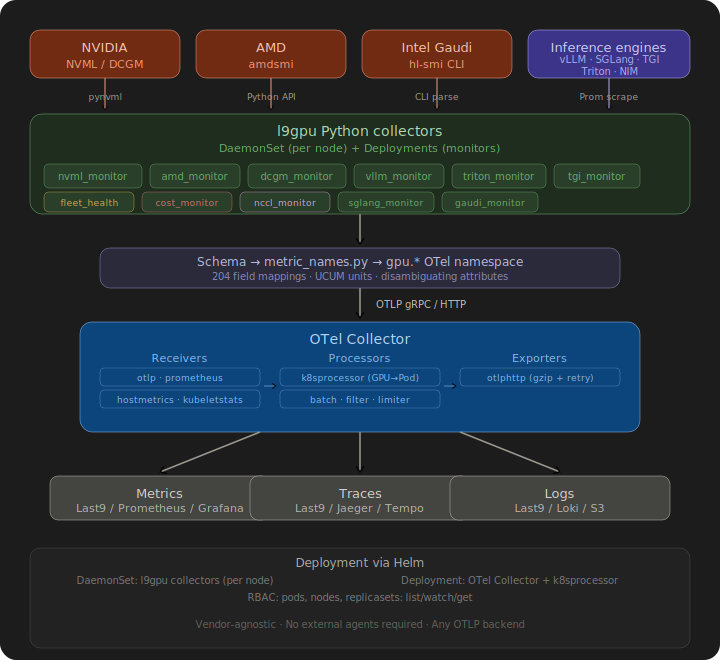

# Last9 GPU Telemetry — Integration Guide

**Last updated:** 2026-03-01

This document is the authoritative reference for deploying Last9 GPU Telemetry (`l9gpu`) and routing GPU metrics and logs to Last9. It covers installation, configuration, the full metrics catalog, cloud-specific deployment notes, example use cases for dashboards and alerts, and step-by-step Last9 dashboard and alert setup.

---

## Table of Contents

1. [Introduction](#1-introduction)
2. [Architecture](#2-architecture)
3. [Metrics Reference](#3-metrics-reference) — incl. DCGM profiling, vLLM, NIM
4. [Logs Reference](#4-logs-reference)
5. [Use Cases & Example Queries](#5-use-cases--example-queries)
6. [Last9 Dashboard Setup](#6-last9-dashboard-setup)
7. [Last9 Alert Studio Setup](#7-last9-alert-studio-setup)
8. [Authentication Setup](#8-authentication-setup)
9. [AWS Integration (EKS)](#9-aws-integration-eks)
10. [Azure Integration (AKS)](#10-azure-integration-aks)
11. [GCP Integration (GKE)](#11-gcp-integration-gke)
12. [On-Premises Integration](#12-on-premises-integration)
13. [Configuration Reference](#13-configuration-reference)

---

## 1. Introduction

Last9 GPU Telemetry (`l9gpu`) is a vendor-agnostic GPU observability collector. It collects hardware telemetry from GPU nodes and exports it as OpenTelemetry (OTLP) metrics and logs, enabling unified GPU observability across heterogeneous clusters.

**Problem it solves:** GPU clusters are expensive and hard to observe. Without GPU-level telemetry, it is impossible to detect wasted capacity, attribute costs to teams or jobs, catch hardware failures early, or diagnose training performance regressions.

**Supported GPU vendors:**

| Vendor | Models | Collection API |
|--------|--------|----------------|
| NVIDIA | A100, H100/H200 (Hopper), B200/GB200 (Blackwell) | NVML (pynvml) |
| AMD | MI300X, MI325X (CDNA3) | amdsmi |
| Intel Gaudi | Gaudi 2 (HL-225), Gaudi 3 (HL-325L/H) | hl-smi CLI |

**Two signal types emitted:**

- **Metrics** — exported every 60 seconds (configurable) as OTLP gauge data points. One data point per GPU per metric.
- **Logs** — one OTLP log record per GPU per collection cycle. Contains structured JSON with the full metric snapshot plus job attribution fields. Useful for audit trails and cost queries.

---

## 2. Architecture

<p align="center">
  
</p>

Auth headers can be injected via:
- **OTel Collector** (recommended for production) — l9gpu sends unauthenticated OTLP locally; the collector adds auth and forwards to your backend.
- **Env var** `OTEL_EXPORTER_OTLP_HEADERS` — simpler, suitable for testing or bare-metal deployments.

The optional **k8sprocessor** (Go OTel processor plugin) enriches metrics with Kubernetes pod/namespace/label attributes by calling the K8s API. It must be compiled into a custom OTel Collector build or deployed as a separate OTel Collector instance.

### 2.1 OTLP Backend Configuration

`l9gpu` exports to any OTLP-compatible backend or a self-hosted OTel Collector
pipeline. Configure the endpoint and auth header via environment variables; the
exporter is otherwise backend-agnostic.

**HTTP (recommended — works through most firewalls):**

```yaml
exporters:
  otlphttp/backend:
    endpoint: https://otel-collector.example.com       # replace with your backend
    headers:
      Authorization: "Basic ${OTLP_AUTH_TOKEN}"        # or "Bearer <token>"
```

**gRPC (lower latency, higher throughput for large fleets):**

```yaml
exporters:
  otlp/backend:
    endpoint: otel-collector.example.com:4317
    headers:
      Authorization: "Basic ${OTLP_AUTH_TOKEN}"
    tls:
      insecure: false
```

> For Last9 users, regional OTLP endpoints and auth setup are documented at
> [Last9 OpenTelemetry Integration](https://last9.io/docs/integrations/observability/opentelemetry/).

---

## 3. Metrics Reference

> **Full catalog:** For the complete list of every metric name, unit, and disambiguating
> attribute across all integrations (NVML, DCGM, vLLM, NIM, AMD, Gaudi), see
> [docs/METRICS.md](./METRICS.md).

All metrics use the `gpu.*` namespace. Data points are emitted per GPU device per collection cycle (default: 60 seconds). Metric attributes (Section 3.10) are attached to every data point.

> **PromQL naming convention:** When metrics are stored in Last9's Prometheus-compatible store, OTel metric names are converted: dots become underscores (e.g., `gpu.utilization` → `gpu_utilization`). OTel attribute names similarly convert (e.g., `k8s.cluster.name` → `k8s_cluster_name`, `gpu.temperature.sensor` → `gpu_temperature_sensor`). All PromQL examples in this document use the Prometheus metric names.

### 3.1 Core Device Metrics

Emitted per GPU, every collection cycle.

| OTel Metric Name | Prometheus Name | Unit | Type | Description | Vendor Support |
|---|---|---|---|---|---|
| `gpu.utilization` | `gpu_utilization` | `1` (ratio 0–1) | Gauge | SM/shader utilization fraction | NVIDIA, AMD, Gaudi |
| `gpu.memory.utilization` | `gpu_memory_utilization` | `1` | Gauge | Memory controller utilization fraction | NVIDIA, AMD, Gaudi |
| `gpu.memory.used.percent` | `gpu_memory_used_percent` | `1` | Gauge | Memory bytes used as a fraction of total | NVIDIA, AMD, Gaudi |
| `gpu.memory.used` | `gpu_memory_used` | `By` | Gauge | Absolute VRAM bytes in use | NVIDIA, AMD, Gaudi |
| `gpu.memory.total` | `gpu_memory_total` | `By` | Gauge | Total VRAM capacity in bytes | NVIDIA, AMD, Gaudi |
| `gpu.memory.free` | `gpu_memory_free` | `By` | Gauge | Free VRAM bytes available | NVIDIA, AMD, Gaudi |
| `gpu.temperature` | `gpu_temperature` | `Cel` | Gauge | Die temperature (disambiguated by `gpu.temperature.sensor` attribute) | NVIDIA, AMD, Gaudi |
| `gpu.power.draw` | `gpu_power_draw` | `W` | Gauge | Instantaneous power consumption | NVIDIA, AMD, Gaudi |
| `gpu.power.utilization` | `gpu_power_utilization` | `1` | Gauge | Power draw as a fraction of TDP limit | NVIDIA, AMD |
| `gpu.power.state` | `gpu_power_state` | `1` | Gauge | GPU P-state (0=full compute, 8=idle) | NVIDIA |
| `gpu.throttle.reason` | `gpu_throttle_reason` | `1` | Gauge | Clock throttle reason bitmask (why clock is limited) | NVIDIA |
| `gpu.clock.frequency` | `gpu_clock_frequency` | `MHz` | Gauge | Clock frequency (disambiguated by `gpu.clock.type` attribute) | NVIDIA |
| `gpu.fan.speed` | `gpu_fan_speed` | `1` | Gauge | Fan speed as percent of max (0–100) | NVIDIA (bare-metal only) |

> **Note:** `gpu.utilization` carries attribute `gpu.task.type=compute`. `gpu.memory.utilization` carries `gpu.task.type=memory_controller`. `gpu.throttle.reason` is a bitmask — consult NVML documentation for bit meanings (thermal throttle, power throttle, sync boost, etc.). `gpu.clock.frequency` is emitted twice per device with `gpu.clock.type=graphics` and `gpu.clock.type=memory`.
>
> **`gpu.fan.speed` availability:** Cloud GPU instances (AWS EC2, GCP, Azure) are fanless — thermal management is handled at the rack/hypervisor level. NVML returns no fan speed on these instances, so `gpu.fan.speed` is **not emitted** in cloud environments. It is only present on bare-metal servers with GPU fan control (e.g., DGX stations, on-premises clusters).

### 3.2 Error & Reliability Metrics

| OTel Metric Name | Prometheus Name | Unit | Type | Description | Vendor | Data-point Attribute |
|---|---|---|---|---|---|---|
| `gpu.row_remap.count` | `gpu_row_remap_count` | `{row}` | Counter | Retired/remapped DRAM rows (correctable single-bit ECC) | NVIDIA | `gpu.ecc.error_type=correctable` |
| `gpu.row_remap.count` | `gpu_row_remap_count` | `{row}` | Counter | Retired DRAM rows (uncorrectable double-bit ECC) | NVIDIA | `gpu.ecc.error_type=uncorrectable` |
| `gpu.row_remap.count` | `gpu_row_remap_count` | `{row}` | Counter | DRAM rows replaced (correctable) | Gaudi | `gpu.row_remap.state=replaced` |
| `gpu.row_remap.pending` | `gpu_row_remap_pending` | `{row}` | Counter | Rows pending remap (reboot required) | Gaudi | `gpu.row_remap.state=pending` |
| `gpu.ecc.errors` | `gpu_ecc_errors` | `{error}` | Counter | ECC errors per memory block (40+ blocks reported individually) | AMD | `gpu.ecc.memory_block=<block_name>` |
| `gpu.ecc.errors` | `gpu_ecc_errors` | `{error}` | Gauge | Volatile (session-scoped) correctable ECC errors — resets on driver restart | NVIDIA | `gpu.ecc.error_type=correctable, gpu.ecc.count_type=volatile` |
| `gpu.ecc.errors` | `gpu_ecc_errors` | `{error}` | Gauge | Volatile (session-scoped) uncorrectable ECC errors — resets on driver restart | NVIDIA | `gpu.ecc.error_type=uncorrectable, gpu.ecc.count_type=volatile` |

### 3.3 NVIDIA-Specific Metrics (Encode, Decode, XID, PCIe Replay, Energy)

Collected by `l9gpu nvml_monitor` on NVIDIA GPUs.

| OTel Metric Name | Prometheus Name | Unit | Type | Description | Data-point Attribute |
|---|---|---|---|---|---|
| `gpu.encode.utilization` | `gpu_encode_utilization` | `` | Gauge | Video decoder engine utilization (0–100) | `gpu.task.type=decoder` |
| `gpu.xid.errors` | `gpu_xid_errors` | `{error}` | Counter | Cumulative XID error count (reliability signal; non-zero indicates hardware event) | — |
| `gpu.pcie.replay.count` | `gpu_pcie_replay_count` | `{event}` | Counter | Cumulative PCIe replay counter (link integrity signal) | — |
| `gpu.energy.consumption` | `gpu_energy_consumption` | `mJ` | Counter | Cumulative energy consumption in millijoules | — |
| `gpu.throttle.reason` | `gpu_throttle_reason` | `1` | Gauge | Named throttle reason boolean (1=active) | `gpu.throttle.cause=<cause>` |

**`gpu.throttle.reason` cause values:**

| `gpu.throttle.cause` | Description |
|---|---|
| `power_software` | Software power cap (e.g., `nvidia-smi --power-limit`) |
| `temp_hardware` | Hardware thermal protection engaged |
| `temp_software` | Software thermal slowdown threshold hit |
| `syncboost` | Sync-boost across multiple GPUs |

> The raw bitmask is still emitted as `gpu.throttle.reason` (Gap 5 in the original metrics table). The named boolean fields above are added alongside it for operational usability — set `gpu.throttle.cause=power_software` etc. in your alert filter to catch specific throttle conditions.

### 3.4 DCGM Profiling Metrics

Collected by `l9gpu dcgm_monitor` by scraping the [dcgm-exporter](https://github.com/NVIDIA/dcgm-exporter) Prometheus endpoint. These metrics require DCGM and dcgm-exporter to be running on the node (standard in Kubernetes GPU clusters).

**Quick start:**
```bash
l9gpu dcgm_monitor \
  --dcgm-endpoint http://localhost:9400/metrics \
  --cluster prod-training \
  --sink otel \
  --push-interval 60
```

| OTel Metric Name | Prometheus Name | Unit | DCGM Field | Description |
|---|---|---|---|---|
| `gpu.sm.active` | `gpu_sm_active` | `1` | `DCGM_FI_PROF_SM_ACTIVE` | Fraction of time ≥1 warp is active on any SM (overall GPU compute utilization, higher resolution than NVML) |
| `gpu.dram.active` | `gpu_dram_active` | `1` | `DCGM_FI_PROF_DRAM_ACTIVE` | Fraction of time DRAM memory interface is transferring data (memory bandwidth saturation) |
| `gpu.gr_engine.active` | `gpu_gr_engine_active` | `1` | `DCGM_FI_PROF_GR_ENGINE_ACTIVE` | Fraction of time the graphics/compute engine is active |
| `gpu.pipe.tensor.active` | `gpu_pipe_tensor_active` | `1` | `DCGM_FI_PROF_PIPE_TENSOR_ACTIVE` | Fraction of cycles tensor cores are executing (MMA operations) |
| `gpu.pipe.fp64.active` | `gpu_pipe_fp64_active` | `1` | `DCGM_FI_PROF_PIPE_FP64_ACTIVE` | Fraction of cycles FP64 (double precision) pipes are active |
| `gpu.pipe.fp32.active` | `gpu_pipe_fp32_active` | `1` | `DCGM_FI_PROF_PIPE_FP32_ACTIVE` | Fraction of cycles FP32 (single precision) pipes are active |
| `gpu.pipe.fp16.active` | `gpu_pipe_fp16_active` | `1` | `DCGM_FI_PROF_PIPE_FP16_ACTIVE` | Fraction of cycles FP16/BF16 pipes are active |

> **AI workload efficiency signal:** For transformer training/inference, `gpu.pipe.tensor.active` measures how effectively the GPU's tensor cores are used. A well-optimized H100 training run typically shows tensor active > 0.60. Low tensor active combined with high SM active indicates non-tensor compute (e.g., elementwise ops, attention softmax) is dominating. Compare `gpu.pipe.fp16.active` and `gpu.pipe.tensor.active` to identify workloads that would benefit from BF16 Tensor Core kernels.

**Resource attributes:** Same `gpu.index`, `gpu.uuid`, `gpu.model` labels as NVML metrics (populated from dcgm-exporter labels).

### 3.5 vLLM Integration Metrics

Collected by `l9gpu vllm_monitor` by scraping the vLLM Prometheus endpoint. Run one `vllm_monitor` process per vLLM server instance.

**Quick start:**
```bash
l9gpu vllm_monitor \
  --vllm-endpoint http://localhost:8000/metrics \
  --model-name llama3-70b \
  --cluster prod-inference \
  --sink otel \
  --push-interval 30
```

| OTel Metric Name | Prometheus Name | Unit | Description | Data-point Attribute |
|---|---|---|---|---|
| `vllm.prompt.throughput` | `vllm_prompt_throughput` | `{token}/s` | Prompt tokens processed per second | — |
| `vllm.generation.throughput` | `vllm_generation_throughput` | `{token}/s` | Generated tokens per second | — |
| `vllm.request.latency` | `vllm_request_latency` | `s` | End-to-end request latency percentile | `quantile=p50/p95/p99` |
| `vllm.ttft` | `vllm_ttft` | `s` | Time-to-first-token latency percentile | `quantile=p50/p95` |
| `vllm.cache.usage` | `vllm_cache_usage` | `1` | KV-cache utilization fraction (0–1) | `cache.type=gpu` or `cache.type=cpu` |
| `vllm.requests.running` | `vllm_requests_running` | `{request}` | Requests currently being decoded | — |
| `vllm.requests.waiting` | `vllm_requests_waiting` | `{request}` | Requests queued, waiting for a free slot | — |
| `vllm.requests.swapped` | `vllm_requests_swapped` | `{request}` | Requests with KV cache swapped to CPU | — |

**Resource attributes added:** `vllm.model.name` (from `--model-name`), `host.name`, `k8s.cluster.name`.

> Throughput values (`vllm.prompt.throughput`, `vllm.generation.throughput`) are computed as the rate of change of vLLM's cumulative token counters across successive scrape intervals. The first scrape cycle will emit `None` for these fields. Latency percentiles are estimated from Prometheus histogram buckets using linear interpolation (equivalent to Prometheus `histogram_quantile()`).

### 3.6 NVIDIA NIM Integration Metrics

Collected by `l9gpu nim_monitor` by scraping the NVIDIA NIM Prometheus endpoint. Run one `nim_monitor` process per NIM container.

**Quick start:**
```bash
l9gpu nim_monitor \
  --nim-endpoint http://localhost:8000/metrics \
  --model llama3-70b-instruct \
  --cluster prod-nim \
  --sink otel \
  --push-interval 30
```

| OTel Metric Name | Prometheus Name | Unit | Description | Data-point Attribute |
|---|---|---|---|---|
| `nim.requests.total` | `nim_requests_total` | `{request}` | Cumulative total request count | — |
| `nim.requests.failed` | `nim_requests_failed` | `{request}` | Cumulative failed request count | — |
| `nim.request.latency` | `nim_request_latency` | `s` | Request latency percentile | `quantile=p50/p99` |
| `nim.batch.size` | `nim_batch_size` | `{request}` | Average batch size | — |
| `nim.queue.depth` | `nim_queue_depth` | `{request}` | Current request queue depth | — |
| `nim.kv_cache.usage` | `nim_kv_cache_usage` | `1` | GPU KV-cache utilization fraction (0–1) | — |

**Resource attributes added:** `nim.model` (from `--model`), `host.name`, `k8s.cluster.name`.

### 3.7 Interconnect Metrics

| OTel Metric Name | Prometheus Name | Unit | Type | Description | Vendor | Data-point Attributes |
|---|---|---|---|---|---|---|
| `gpu.interconnect.throughput` | `gpu_interconnect_throughput` | `By/s` | Gauge | Bandwidth per link in receive direction | AMD (XGMI), Gaudi (RoCE) | `gpu.interconnect.direction=receive` |
| `gpu.interconnect.throughput` | `gpu_interconnect_throughput` | `By/s` | Gauge | Bandwidth per link in transmit direction | AMD (XGMI), Gaudi (RoCE) | `gpu.interconnect.direction=transmit` |
| `gpu.interconnect.throughput` | `gpu_interconnect_throughput` | `By/s` | Gauge | NVLink aggregate receive throughput | NVIDIA | `gpu.interconnect.type=nvlink, gpu.interconnect.direction=receive` |
| `gpu.interconnect.throughput` | `gpu_interconnect_throughput` | `By/s` | Gauge | NVLink aggregate transmit throughput | NVIDIA | `gpu.interconnect.type=nvlink, gpu.interconnect.direction=transmit` |
| `gpu.pcie.throughput` | `gpu_pcie_throughput` | `By/s` | Gauge | PCIe receive throughput (host↔GPU data path) | NVIDIA | `gpu.interconnect.type=pcie, gpu.interconnect.direction=receive` |
| `gpu.pcie.throughput` | `gpu_pcie_throughput` | `By/s` | Gauge | PCIe transmit throughput | NVIDIA | `gpu.interconnect.type=pcie, gpu.interconnect.direction=transmit` |

- AMD MI300X: 8 XGMI links, each identified by `gpu.interconnect.link_index` (0–7). Attribute `gpu.interconnect.type=xgmi`.
- Intel Gaudi 3 (HL-325L/H): 24 RoCE ports, each identified by `gpu.interconnect.link_index` (0–23).

### 3.8 Multi-Temperature Sensors

`gpu.temperature` is emitted multiple times per device when multiple sensors are available. The `gpu.temperature.sensor` attribute disambiguates:

| `gpu.temperature.sensor` Value | Prometheus Label Value | Description | Vendor |
|---|---|---|---|
| `edge` | `gpu_temperature_sensor="edge"` | Die edge temperature (default NVIDIA, AMD) | NVIDIA, AMD |
| `hotspot` | `gpu_temperature_sensor="hotspot"` | Junction/hotspot temperature | AMD |
| `memory` | `gpu_temperature_sensor="memory"` | HBM temperature | AMD |
| `aip` | `gpu_temperature_sensor="aip"` | SoC max temperature (from hl-smi) | Gaudi |

### 3.9 Host Aggregate Metrics

One set of host-level metrics per node, emitted per collection cycle.

| OTel Metric Name | Prometheus Name | Unit | Description |
|---|---|---|---|
| `gpu.utilization.max` | `gpu_utilization_max` | `1` | Max utilization across all GPUs on the node |
| `gpu.utilization.min` | `gpu_utilization_min` | `1` | Min utilization across all GPUs on the node |
| `gpu.utilization.avg` | `gpu_utilization_avg` | `1` | Average utilization across all GPUs |
| `host.memory.utilization` | `host_memory_utilization` | `1` | Host DRAM utilization fraction |

### 3.10 Metric Attributes

Every metric data point carries the following attributes. **OTel Resource attributes** (`gpu.vendor`, `host.name`, `service.name`, `k8s.cluster.name`) are set at the Resource level and are common across all data points from a single collection cycle. **Per-data-point attributes** (`gpu.index`, `gpu.uuid`, `gpu.model`) are set on each individual data point and vary per GPU device.

| OTel Attribute | Prometheus Label | Example | Source | Scope |
|---|---|---|---|---|
| `gpu.vendor` | `gpu_vendor` | `nvidia`, `amd`, `intel_gaudi` | CLI `--vendor` flag | Resource |
| `host.name` | `host_name` | `node-42.cluster.internal` | OS hostname | Resource |
| `service.name` | `service_name` | `l9gpu` | Hardcoded | Resource |
| `k8s.cluster.name` | `k8s_cluster_name` | `prod-training` | `--cluster` flag / env var | Resource |
| `gpu.index` | `gpu_index` | `0` | Device ordinal | Per-data-point |
| `gpu.uuid` | `gpu_uuid` | `GPU-abc123...` | Driver API | Per-data-point |
| `gpu.model` | `gpu_model` | `NVIDIA H100 SXM5 80GB` | Driver API | Per-data-point |

### 3.11 K8s Attribution Attributes

Enriched by `k8sprocessor` when deployed as an OTel Collector plugin.

| OTel Attribute | Prometheus Label | Description |
|---|---|---|
| `k8s.pod.name` | `k8s_pod_name` | Pod currently using this GPU |
| `k8s.namespace.name` | `k8s_namespace_name` | Kubernetes namespace |
| `k8s.node.name` | `k8s_node_name` | Node name |
| `k8s.container.name` | `k8s_container_name` | Container within the pod |
| `k8s.job.name` | `k8s_job_name` | Batch Job owning the pod (ML training run identity) |
| `k8s.statefulset.name` | `k8s_statefulset_name` | StatefulSet owning the pod |
| `k8s.deployment.name` | `k8s_deployment_name` | Deployment owning the pod (via ReplicaSet) |
| `k8s.pod.label.app` | `k8s_pod_label_app` | Standard app label (and other pod labels) |
| `cloud.availability_zone` | `cloud_availability_zone` | AZ from node label `topology.kubernetes.io/zone` |
| `cloud.region` | `cloud_region` | Region from node label `topology.kubernetes.io/region` |

> `k8s.job.name`, `k8s.statefulset.name`, `k8s.deployment.name` are resolved by walking `pod.ownerReferences` at collection time. At most one will be non-empty per pod.

> `cloud.availability_zone` and `cloud.region` are injected at the OTel **Resource** level (not per-datapoint) and are populated by fetching the node object from the K8s API. They are empty on non-cloud nodes or nodes without `topology.kubernetes.io/*` labels. These attributes enable multi-AZ and multi-region filtering in Last9.

> The `k8sprocessor` is a Go OTel processor plugin — it must be compiled into a custom OTel Collector build or run as a separate OTel Collector instance that receives OTLP from the standard collector and re-exports to Last9 with enriched attributes.

---

## 4. Logs Reference

The collector emits one OTLP log record per GPU per collection cycle. The log body is a structured JSON object. Log records carry the same resource attributes as metrics (Section 3.10).

**Example log body (NVIDIA):**

```json
{
  "device_index": 0,
  "gpu_util": 87,
  "mem_util": 43,
  "mem_used_percent": 68,
  "temperature": 72,
  "power_draw": 312,
  "power_used_percent": 97,
  "retired_pages_count_single_bit": 0,
  "retired_pages_count_double_bit": 0,
  "job_id": 12345,
  "job_user": "alice",
  "job_name": "llama3-pretrain",
  "job_num_gpus": 8,
  "job_partition": "a100"
}
```

**Example log body (AMD MI300X):**

```json
{
  "device_index": 2,
  "gpu_util": 91,
  "mem_util": 55,
  "mem_used_percent": 73,
  "temperature": 68,
  "junction_temperature": 81,
  "hbm_temperature": 74,
  "power_draw": 498,
  "power_used_percent": 83,
  "ecc_per_block": {
    "UMC0": 0,
    "UMC1": 0,
    "GFX": 0,
    "SDMA": 0
  },
  "xgmi_link_bandwidth": [
    {"link_index": 0, "rx_bytes_per_sec": 182500000000, "tx_bytes_per_sec": 178200000000},
    {"link_index": 1, "rx_bytes_per_sec": 183100000000, "tx_bytes_per_sec": 177900000000}
  ],
  "job_id": 98765,
  "job_user": "bob",
  "job_name": "mixtral-finetune",
  "job_num_gpus": 8,
  "job_partition": "mi300x"
}
```

> AMD-specific fields: `junction_temperature` (hotspot), `hbm_temperature` (HBM stack), `ecc_per_block` (per-block ECC error dictionary), `xgmi_link_bandwidth` (per-link XGMI bandwidth array).

**Example log body (Intel Gaudi 3):**

```json
{
  "device_index": 0,
  "gpu_util": 79,
  "mem_util": 62,
  "mem_used_percent": 58,
  "temperature": 65,
  "power_draw": 420,
  "rows_replaced": 0,
  "rows_pending": 0,
  "network_rx_bandwidth": [
    {"link_index": 0, "bytes_per_sec": 24500000000},
    {"link_index": 1, "bytes_per_sec": 24800000000}
  ],
  "network_tx_bandwidth": [
    {"link_index": 0, "bytes_per_sec": 24300000000},
    {"link_index": 1, "bytes_per_sec": 24700000000}
  ],
  "job_id": 11223,
  "job_user": "carol",
  "job_name": "llava-pretrain-gaudi",
  "job_num_gpus": 8,
  "job_partition": "gaudi3"
}
```

> Gaudi-specific fields: `rows_replaced` / `rows_pending` (HBM row remap health), `network_rx_bandwidth` / `network_tx_bandwidth` (per RoCE port bandwidth arrays, 24 ports on Gaudi 3). Note: `power_draw` on Gaudi reports the 54V rail only — not total system power.

> **Note:** Log body field names use the Python dataclass field naming convention (snake_case without `gpu.` prefix). The canonical OTel metric names in Section 3 differ — e.g., `gpu_util` in logs maps to `gpu.utilization` in metrics. See the Appendix for the full mapping.

### 4.1 Slurm Job Fields in Log Records

On Slurm clusters, job attribution is correlated automatically by inspecting the environment variables of GPU-using processes via `/proc/<pid>/environ`. No extra configuration needed. The following fields are added to the log record body when a Slurm job is detected on the GPU:

| Log Record Field | Type | Description |
|---|---|---|
| `job_id` | int | Slurm job ID (`-1` if no job detected) |
| `job_user` | string | Submitting user |
| `job_name` | string | Job name |
| `job_partition` | string | Slurm partition |
| `job_num_gpus` | int | Total GPUs allocated to the job |

> **These fields appear in OTel Logs only — not in metrics.** To query Slurm job context, use Last9's log explorer and filter on `job_id`, `job_user`, etc. (underscore naming, not dot notation).

**Use logs for:**
- Per-GPU utilization audit trails with full job context
- Job-level cost attribution queries (join on `job_id`, `job_user`)
- Anomaly detection and alerting via log parsing rules
- Historical analysis of GPU health events

---

## 5. Use Cases & Example Queries

All PromQL queries in this section use Prometheus metric names (OTel dots → underscores). These queries run directly in Last9's query editor, dashboard panels, and Alert Studio.

### 5.1 GPU Utilization & Waste Detection

**Metric:** `gpu_utilization` grouped by `k8s_cluster_name`, `host_name`, `gpu_index`

**Waste detection PromQL** — GPUs with allocated jobs but low utilization:

```promql
# GPUs running below 20% utilization for 15 minutes (k8s workloads)
avg_over_time(gpu_utilization{gpu_task_type="compute", k8s_pod_name!=""}[15m]) < 0.20

# Fleet-wide waste rate: fraction of GPU-minutes wasted
1 - avg(avg_over_time(gpu_utilization{gpu_task_type="compute"}[1h]))
```

**Alert threshold:** `avg_over_time(gpu_utilization{gpu_task_type="compute"}[15m]) < 0.20` sustained on a GPU with `k8s_pod_name` set

**Dashboard:** Heatmap of GPU utilization across nodes in a cluster

**Why it matters:** Identifies stranded GPU capacity. A $30/hr H100 running at 5% utilization is $26/hr of waste. Fleet-wide, this compounds quickly.

---

### 5.2 Cost Attribution by Team / Job

**Metric:** `gpu_power_draw` grouped by `k8s_namespace_name`, `job_user`, `job_name`

**GPU-hours per namespace (PromQL):**

```promql
# Approximate GPU-hours consumed per namespace over the last 24h
# (sums utilization * scrape_interval as a proxy for GPU-time)
sum by (k8s_namespace_name) (
  increase(gpu_utilization{gpu_task_type="compute"}[24h])
) / 3600

# Energy consumption (kWh) per namespace — for energy-based chargeback
sum by (k8s_namespace_name) (
  increase(gpu_power_draw[24h])
) / 3600000
```

**Cost formula:**

```
gpu_hours = sum(gpu_utilization * time_window) per namespace/user
cost = gpu_hours × (node_cost / gpus_per_node)
```

**Dashboard:** GPU-hours consumed per namespace per day (stacked bar chart)

**Why it matters:** Enables internal chargeback to business units sharing a GPU cluster.

---

### 5.3 Thermal & Power Management

**Metrics:**
- `gpu_temperature{gpu_temperature_sensor="hotspot"}` — alert if > 90°C
- `gpu_power_utilization` — alert if > 0.95 (throttle risk)

**PromQL queries:**

```promql
# Hotspot temperature by GPU
gpu_temperature{gpu_temperature_sensor="hotspot"}

# GPUs approaching thermal throttle (hotspot > 85°C)
gpu_temperature{gpu_temperature_sensor="hotspot"} > 85

# Power utilization above 95% TDP (throttle risk)
gpu_power_utilization > 0.95

# Thermal headroom remaining (fraction of 95°C safe limit)
(95 - gpu_temperature{gpu_temperature_sensor="hotspot"}) / 95
```

**Dashboard:** Temperature trend over time per GPU, overlaid with power draw

**Why it matters:** Prevents thermal throttling that reduces throughput by up to 30%. Protects hardware from premature failure.

---

### 5.4 ECC / Hardware Failure Early Warning

**Metrics:**
- `gpu_ecc_errors` — any non-zero value on AMD (block-level breakdown)
- `gpu_row_remap_pending` > 0 → reboot required (Gaudi)
- `gpu_row_remap_count{gpu_ecc_error_type="uncorrectable"}` > 0 → GPU replacement candidate (NVIDIA)

**PromQL queries:**

```promql
# NVIDIA: uncorrectable ECC events (double-bit) — immediate alert
increase(gpu_row_remap_count{gpu_ecc_error_type="uncorrectable"}[1h]) > 0

# NVIDIA: correctable ECC trend — track degradation over time
rate(gpu_row_remap_count{gpu_ecc_error_type="correctable"}[7d])

# AMD: any ECC errors across all memory blocks
sum by (host_name, gpu_index) (gpu_ecc_errors) > 0

# Gaudi: rows pending remap (reboot required before failure)
gpu_row_remap_pending{gpu_row_remap_state="pending"} > 0
```

**Log field:** `retired_pages_count_double_bit` > 0 → corroboration for GPU replacement

**Why it matters:** Proactive hardware maintenance before GPU failures cause job crashes. Double-bit ECC errors are unrecoverable in flight.

---

### 5.5 Training Job Performance

**Metric:** `gpu_utilization` per `job_name` over job duration

**PromQL queries:**

```promql
# Utilization for a specific training run
avg by (job_name, host_name, gpu_index) (
  gpu_utilization{gpu_task_type="compute", job_name="llama3-pretrain"}
)

# Training jobs where average GPU utilization is below 60%
# (indicates communication bottleneck or data loading stall)
avg by (job_name) (
  avg_over_time(gpu_utilization{gpu_task_type="compute"}[10m])
) < 0.60

# Multi-GPU spread: utilization variance across GPUs in a job
# High variance indicates load imbalance
stddev by (job_name) (gpu_utilization{gpu_task_type="compute"})
```

**Alert:** `avg_over_time(gpu_utilization{gpu_task_type="compute", job_name=~".+"}[10m]) < 0.60` during an active training job

**Dashboard:** Utilization timeline per training run with job boundary annotations

**Why it matters:** Detects data loading stalls, NCCL communication hangs, and imbalanced workload distribution across GPUs. A well-optimized H100 training job should sustain > 0.85 utilization.

---

### 5.6 Interconnect Saturation (AMD XGMI / Gaudi RoCE)

**Metric:** `gpu_interconnect_throughput` grouped by `gpu_interconnect_link_index`, `gpu_interconnect_direction`

**PromQL queries:**

```promql
# Per-link receive throughput (bytes/sec) — AMD XGMI
gpu_interconnect_throughput{gpu_interconnect_type="xgmi", gpu_interconnect_direction="receive"}

# Per-port throughput — Gaudi RoCE (24 ports)
gpu_interconnect_throughput{gpu_interconnect_direction="receive"}

# Interconnect utilization as fraction of 400 GB/s NVLink theoretical peak
# Adjust denominator for your hardware's max link bandwidth
gpu_interconnect_throughput / 400e9

# Links with imbalanced TX vs RX (indicates collective communication skew)
abs(
  gpu_interconnect_throughput{gpu_interconnect_direction="transmit"} -
  gpu_interconnect_throughput{gpu_interconnect_direction="receive"}
) / gpu_interconnect_throughput{gpu_interconnect_direction="transmit"} > 0.20
```

**Dashboard for Gaudi 3:** 24-port RX/TX heatmap — shows per-port imbalance across collective operations

**Dashboard for AMD MI300X:** 8-link XGMI bandwidth — identifies hot links in all-to-all collectives

**Why it matters:** Interconnect saturation is the primary bottleneck in large-scale training. Per-link visibility is the only way to detect imbalanced collective communication patterns.

---

### 5.7 Capacity Planning

**Metric:** `gpu_utilization_avg` p95 per node per week, broken down by `gpu_model`

**PromQL queries:**

```promql
# p95 GPU utilization per node over the past 7 days
quantile_over_time(0.95, gpu_utilization_avg[7d])

# p95 by architecture type — compare Hopper vs CDNA3 utilization
quantile_over_time(0.95, gpu_utilization_avg[7d]) by (gpu_architecture)

# Nodes consistently above 80% utilization (capacity expansion candidates)
quantile_over_time(0.80, gpu_utilization_avg[7d]) > 0.80

# Nodes consistently below 30% utilization (consolidation candidates)
quantile_over_time(0.95, gpu_utilization_avg[7d]) < 0.30
```

**Dashboard:** Rolling 30-day GPU utilization by architecture type (Hopper vs Blackwell vs CDNA3)

**Why it matters:** Informs procurement decisions and right-sizing of GPU pools. Helps answer: "Do we need more H100s, or are existing ones underutilized?"

---

### 5.8 Multi-Tenant Cluster Chargeback

**Combine:** Log field `job_id` + `job_user` with `gpu_power_draw` over job duration

**PromQL formulas:**

```promql
# Energy-based chargeback: kWh per user over last 30 days
sum by (job_user) (
  increase(gpu_power_draw[30d])
) / 3600000   # W·s → kWh

# Time-based GPU-hours per namespace over last 7 days
sum by (k8s_namespace_name) (
  increase(gpu_utilization{gpu_task_type="compute"}[7d])
) / 3600

# GPU cost allocation (substitute your $/GPU-hour rate)
sum by (k8s_namespace_name) (
  increase(gpu_utilization{gpu_task_type="compute"}[30d])
) / 3600 * 2.50   # $2.50/GPU-hour example rate
```

**Why it matters:** Enables internal billing for HPC and ML platform teams in shared multi-tenant clusters. Reduces over-provisioning incentives.

---

### 5.9 GPU Memory Pressure & OOM Risk

**Metric:** `gpu_memory_used_percent`

**PromQL queries:**

```promql
# GPUs above 90% memory utilization
gpu_memory_used_percent > 0.90

# Sustained memory pressure for 5+ minutes — pre-OOM alert
avg_over_time(gpu_memory_used_percent[5m]) > 0.90

# Memory headroom per GPU (fraction remaining)
1 - gpu_memory_used_percent

# GPUs within 5% of full memory (critical zone)
gpu_memory_used_percent > 0.95
```

**Alert threshold:** `avg_over_time(gpu_memory_used_percent[5m]) > 0.90` for 5 minutes

**Dashboard panel:** Time series per GPU with threshold lines at 90% (warning) and 95% (critical), colored red above threshold

**Why it matters:** Detects near-OOM conditions before jobs crash. Critical for LLM training with large batch sizes where a single OOM event wastes hours of compute. Allows operators to drain jobs before failure, or trigger automatic batch size reduction.

---

### 5.10 Idle GPU Detection (Allocated but Unused)

**Metric:** `gpu_utilization{gpu_task_type="compute"}` with k8s attribution

**PromQL queries:**

```promql
# GPUs with a pod allocated (k8s_pod_name set) but near-zero utilization
avg_over_time(gpu_utilization{gpu_task_type="compute", k8s_pod_name!=""}[10m]) < 0.05

# Count of idle allocated GPUs in each namespace
count by (k8s_namespace_name) (
  avg_over_time(gpu_utilization{gpu_task_type="compute", k8s_pod_name!=""}[10m]) < 0.05
)

# Idle GPU-minutes wasted (aggregated over a day)
sum(
  increase(
    (gpu_utilization{gpu_task_type="compute", k8s_pod_name!=""} < 0.05)[24h:]
  )
) / 60
```

**Alert threshold:** `avg_over_time(gpu_utilization{gpu_task_type="compute", k8s_pod_name!=""}[10m]) < 0.05` for more than 15 minutes

**Dashboard panel:** Count of idle GPUs with drilldown by namespace and pod name

**Why it matters:** Identifies misconfigured jobs, stalled data loaders, checkpoint-writing pauses, or model compile phases (e.g., torch.compile, XLA compilation) that consume reserved GPU allocations without doing compute. Early detection enables re-queuing or operator intervention.

---

### 5.11 Multi-GPU Communication Efficiency

**Metrics:** `gpu_interconnect_throughput` correlated with `gpu_utilization`

**PromQL queries:**

```promql
# Ratio of interconnect activity to compute activity
# High ratio → collective-bound; low ratio → compute-bound
sum by (host_name) (gpu_interconnect_throughput{gpu_interconnect_direction="receive"})
/
sum by (host_name) (gpu_utilization{gpu_task_type="compute"})

# Identify nodes where interconnect is active but compute is low
# (signs of all-reduce bottleneck)
sum by (host_name, job_name) (gpu_interconnect_throughput) > 1e10
and
avg by (host_name, job_name) (gpu_utilization{gpu_task_type="compute"}) < 0.50

# Per-link throughput normalized to maximum (substitute your hardware max)
# AMD MI300X XGMI: ~400 GB/s per link aggregate
gpu_interconnect_throughput{gpu_interconnect_type="xgmi"} / 400e9
```

**Dashboard panel:** Split time-series showing interconnect throughput (top) and GPU compute utilization (bottom) — divergence indicates collective bottleneck

**Why it matters:** Diagnoses NCCL all-reduce bottlenecks in distributed training. When interconnect is saturated and compute utilization drops, the model is waiting on gradient synchronization — a sign to optimize communication topology or ring size.

---

### 5.12 Hardware Aging & Wear Tracking

**Metric:** `gpu_row_remap_count` (NVIDIA ECC row retirement counter)

**PromQL queries:**

```promql
# Total row remaps per GPU (all-time)
gpu_row_remap_count{gpu_ecc_error_type="correctable"}

# New row remaps in the last 30 days (aging trend)
increase(gpu_row_remap_count{gpu_ecc_error_type="correctable"}[30d])

# Row remap acceleration: week-over-week increase rate
rate(gpu_row_remap_count{gpu_ecc_error_type="correctable"}[7d])
>
rate(gpu_row_remap_count{gpu_ecc_error_type="correctable"}[7d] offset 7d) * 1.5

# GPUs with accelerating remap rate (replacement candidates)
increase(gpu_row_remap_count{gpu_ecc_error_type="correctable"}[7d]) > 10
```

**Alert:** Accelerating rate of new row remaps over consecutive 7-day windows (week-over-week rate increase > 50%)

**Dashboard panel:** Table of GPUs sorted by 30-day remap rate with `gpu_uuid` and `host_name` for asset tracking

**Why it matters:** Proactive GPU replacement scheduling before failure. DRAM row retirement is a leading indicator of GPU degradation. Catching acceleration early allows planned maintenance during maintenance windows rather than emergency replacement during training runs.

---

### 5.13 Training Job SLO Monitoring

**SLO definition:** A training run (`job_name`) must maintain >= 80% average GPU utilization over any 1-hour window during training.

**PromQL queries:**

```promql
# Current SLO compliance per job (1 = compliant, 0 = violating)
avg by (job_name) (
  avg_over_time(gpu_utilization{gpu_task_type="compute", job_name=~".+"}[1h])
) >= 0.80

# SLO error rate: fraction of 1h windows below 80% utilization
1 - (
  avg by (job_name) (
    avg_over_time(gpu_utilization{gpu_task_type="compute", job_name=~".+"}[1h])
  ) >= bool 0.80
)

# Training efficiency score (utilization as % of SLO target)
avg by (job_name) (
  avg_over_time(gpu_utilization{gpu_task_type="compute", job_name=~".+"}[1h])
) / 0.80 * 100
```

**Alert:** Training SLO violation when `avg_over_time(gpu_utilization{job_name=~".+"}[1h]) < 0.80` for a named training run — surfaces regressions between experiment runs

**Dashboard panel:** Per-job utilization timeline with SLO threshold line; color coding (green ≥ 80%, yellow 60–80%, red < 60%)

**Why it matters:** Catches training efficiency regressions between experiments (e.g., after a batch size change, optimizer switch, or data pipeline modification). Enables fast feedback on whether infrastructure changes degraded training throughput.

---

### 5.14 Host Memory Pressure Correlated with GPU Workloads

**Metrics:** `host_memory_utilization` correlated with `gpu_memory_used_percent`

**PromQL queries:**

```promql
# Nodes where both host and GPU memory are under pressure simultaneously
host_memory_utilization > 0.90
and on(host_name)
avg by (host_name) (gpu_memory_used_percent) > 0.80

# Host memory saturation by node
host_memory_utilization{} > 0.85

# Nodes with high host memory AND low GPU utilization (swap-induced stall)
host_memory_utilization > 0.90
and on(host_name)
avg by (host_name) (gpu_utilization{gpu_task_type="compute"}) < 0.50
```

**Alert threshold:** `host_memory_utilization > 0.90 AND avg(gpu_memory_used_percent) by (host_name) > 0.80` — correlated pressure

**Dashboard panel:** Dual time-series: host DRAM % used (top) and GPU memory % used (bottom) per node, with linked x-axis

**Why it matters:** CPU memory swapping during GPU training causes severe slowdowns — the CPU cannot prepare the next batch fast enough, starving the GPU. This pattern manifests as GPU utilization drops coinciding with host memory peaks. Catching it early allows operators to reduce dataloader workers, decrease batch prefetch buffer size, or move to host-pinned memory strategies.

---

### 5.15 GPU Fleet Health Score (Composite)

**Composite metric:** combines utilization availability, ECC error rate, temperature compliance, and row remap rate into a single health signal per cluster.

**PromQL queries:**

```promql
# Component scores (each 0–1, where 1 = healthy)

# Utilization health: fraction of GPUs above 10% utilization (not idle/failed)
avg by (k8s_cluster_name) (
  gpu_utilization{gpu_task_type="compute"} > bool 0.10
)

# Temperature health: fraction of GPUs below 85°C hotspot threshold
avg by (k8s_cluster_name) (
  gpu_temperature{gpu_temperature_sensor="hotspot"} < bool 85
)

# ECC health: fraction of GPUs with zero uncorrectable errors in last 24h
avg by (k8s_cluster_name) (
  increase(gpu_row_remap_count{gpu_ecc_error_type="uncorrectable"}[24h]) == bool 0
)

# Composite fleet health score (equal weighting)
(
  avg by (k8s_cluster_name) (gpu_utilization{gpu_task_type="compute"} > bool 0.10)
  + avg by (k8s_cluster_name) (gpu_temperature{gpu_temperature_sensor="hotspot"} < bool 85)
  + avg by (k8s_cluster_name) (increase(gpu_row_remap_count{gpu_ecc_error_type="uncorrectable"}[24h]) == bool 0)
) / 3
```

**Dashboard panel:** Single stat (large number) showing fleet health % per cluster; traffic-light coloring (green ≥ 90%, yellow 70–90%, red < 70%)

**Why it matters:** Provides an executive-level view of GPU fleet operational health without requiring knowledge of individual metrics. Surfaces clusters that need attention at a glance. Useful for SRE daily health checks and operations runbooks.

---

### 5.16 Inference vs Training Workload Mix

**Metric:** `gpu_utilization` grouped by `k8s_namespace_name`

**PromQL queries:**

```promql
# Utilization pattern by namespace — training shows sustained high; inference shows burst
avg by (k8s_namespace_name) (
  gpu_utilization{gpu_task_type="compute"}
)

# Utilization coefficient of variation per namespace
# High CV = burst/inference pattern; Low CV = sustained/training pattern
stddev_over_time(
  avg by (k8s_namespace_name) (gpu_utilization{gpu_task_type="compute"})[1h:]
)
/
avg_over_time(
  avg by (k8s_namespace_name) (gpu_utilization{gpu_task_type="compute"})[1h:]
)

# GPU-hours actually consumed vs wall-clock allocated (efficiency ratio)
sum by (k8s_namespace_name) (
  avg_over_time(gpu_utilization{gpu_task_type="compute"}[1h])
)
```

**Dashboard panel:** Stacked bar chart of average GPU utilization by namespace; annotate with workload type (training/inference/batch)

**Why it matters:** Right-sizes GPU pool allocation between inference and training workloads. Inference workloads have spiky, low-average-utilization profiles that are inefficient on expensive SXM GPUs — they often run better on PCIe variants or on fractional GPU allocations (MIG). Identifying the mix allows platform teams to place workloads on cost-appropriate hardware.

---

## 6. Last9 Dashboard Setup

This section provides a recommended GPU Fleet Dashboard for Last9 with eight panels covering the most critical GPU observability signals.

### 6.1 Creating the Dashboard

1. Log in to Last9 and navigate to **Dashboards** in the left sidebar.
2. Click **+ New Dashboard**.
3. Name it `GPU Fleet — [cluster name]` (e.g., `GPU Fleet — prod-training`).
4. Set the time range to **Last 3 hours** as the default view.
5. Add each panel below using **+ Add Panel → Time Series / Stat / Bar Chart / Table** as specified.

### 6.2 Recommended Panels

#### Panel 1: GPU Fleet Utilization Heatmap

| Setting | Value |
|---|---|
| Visualization | Bar chart (grouped by host) |
| Title | `GPU Utilization by Node` |
| Unit | `Percent (0–1)` |
| Min/Max | 0 / 1 |

**Query:**

```promql
avg by (host_name, gpu_index) (
  gpu_utilization{gpu_task_type="compute", k8s_cluster_name="$cluster"}
)
```

**Purpose:** Shows utilization distribution across all GPUs in the fleet. Immediately surfaces nodes with idle GPUs (near 0) or imbalanced jobs.

---

#### Panel 2: Memory Usage by Node

| Setting | Value |
|---|---|
| Visualization | Time series |
| Title | `GPU Memory Used (%)` |
| Unit | `Percent (0–1)` |
| Thresholds | 0.80 (orange), 0.90 (red) |

**Query:**

```promql
avg by (host_name) (
  gpu_memory_used_percent{k8s_cluster_name="$cluster"}
)
```

**Purpose:** Tracks memory pressure trends per node. Sustained values above 90% indicate OOM risk for running jobs.

---

#### Panel 3: Power Draw — Fleet Total

| Setting | Value |
|---|---|
| Visualization | Stat (single value) |
| Title | `Total Fleet Power Draw` |
| Unit | `Watts (W)` |
| Color mode | Background (green → yellow → red) |

**Query:**

```promql
sum by (k8s_cluster_name) (
  gpu_power_draw{k8s_cluster_name="$cluster"}
)
```

**Purpose:** Aggregate real-time power consumption for the cluster. Useful for energy cost tracking and capacity planning against facility power limits.

---

#### Panel 4: Temperature by GPU

| Setting | Value |
|---|---|
| Visualization | Time series |
| Title | `Hotspot Temperature` |
| Unit | `Celsius (°C)` |
| Thresholds | 80 (yellow), 90 (red) |

**Query:**

```promql
gpu_temperature{
  gpu_temperature_sensor="hotspot",
  k8s_cluster_name="$cluster"
}
```

**Purpose:** Hotspot temperature is the best leading indicator of thermal throttle. Trending upward > 85°C warrants investigation of cooling or workload scheduling.

---

#### Panel 5: ECC Error Events

| Setting | Value |
|---|---|
| Visualization | Table |
| Title | `ECC Errors — Last 1 Hour` |
| Columns | `host_name`, `gpu_index`, `gpu_uuid`, `gpu_ecc_error_type`, `errors` |

**Query:**

```promql
increase(gpu_row_remap_count{k8s_cluster_name="$cluster"}[1h]) > 0
```

**Purpose:** Lists GPUs with any ECC events in the last hour. Uncorrectable events require immediate attention; correctable events should be tracked as a trend.

---

#### Panel 6: GPU-Hours by Team (Namespace)

| Setting | Value |
|---|---|
| Visualization | Bar chart |
| Title | `GPU-Hours Consumed by Namespace (24h)` |
| Unit | `GPU-hours` |

**Query:**

```promql
sum by (k8s_namespace_name) (
  increase(gpu_utilization{gpu_task_type="compute", k8s_cluster_name="$cluster"}[24h])
) / 3600
```

**Purpose:** Shows which teams consumed the most GPU time. Foundation for chargeback and capacity negotiation with business units.

---

#### Panel 7: Interconnect Throughput

| Setting | Value |
|---|---|
| Visualization | Time series |
| Title | `Interconnect Throughput (RX)` |
| Unit | `Bytes/sec` |

**Query:**

```promql
gpu_interconnect_throughput{
  gpu_interconnect_direction="receive",
  k8s_cluster_name="$cluster"
}
```

**Purpose:** Shows per-link interconnect receive bandwidth. Saturation indicates all-reduce bottlenecks. Imbalance across links indicates skewed collective topologies.

---

#### Panel 8: Idle GPU Count

| Setting | Value |
|---|---|
| Visualization | Stat (single value) |
| Title | `Idle GPUs (Allocated, <5% Util)` |
| Unit | `GPUs` |
| Color mode | Background (0 = green, >0 = red) |

**Query:**

```promql
count(
  avg_over_time(
    gpu_utilization{gpu_task_type="compute", k8s_pod_name!="", k8s_cluster_name="$cluster"}[10m]
  ) < 0.05
)
```

**Purpose:** Instant visibility into idle-but-allocated GPUs. Any non-zero value warrants investigation of which pods are allocated but not computing.

---

### 6.3 Dashboard Variables

Add these template variables to make the dashboard multi-cluster:

| Variable | Type | Query | Label |
|---|---|---|---|
| `$cluster` | Query | `label_values(gpu_utilization, k8s_cluster_name)` | Cluster |
| `$host` | Query | `label_values(gpu_utilization{k8s_cluster_name="$cluster"}, host_name)` | Node |
| `$namespace` | Query | `label_values(gpu_utilization{k8s_cluster_name="$cluster"}, k8s_namespace_name)` | Namespace |

---

## 7. Last9 Alert Studio Setup

This section provides step-by-step instructions for creating GPU monitoring alerts in Last9 Alert Studio.

### 7.1 Accessing Alert Studio

1. Log in to Last9.
2. Navigate to **Alerts** in the left sidebar.
3. Click **Alert Studio** to enter the alert configuration interface.

### 7.2 Creating an Alert Group

Group all GPU alerts together for organized routing:

1. In Alert Studio, click **+ New Alert Group**.
2. Name: `GPU Fleet Monitoring`
3. Description: `Alerts for GPU utilization, thermal, memory, ECC, and interconnect health`
4. Tags: `gpu`, `infrastructure`, `ml-platform`

### 7.3 Alert Rule Configurations

For each alert below:
1. Click **+ New Alert** within the `GPU Fleet Monitoring` group.
2. Set the **Indicator** (PromQL query).
3. Set the **Threshold** and **Sensitivity Window** (bad minutes / evaluation window).
4. Configure **Notification Channels**.

---

#### Alert 1: GPU Waste — Allocated but Underutilized

| Field | Value |
|---|---|
| Name | `GPU Waste — Low Utilization on Allocated GPU` |
| Indicator | See query below |
| Threshold | > 0 (any GPU matching) |
| Sensitivity | 10 bad minutes out of 15 |
| Severity | `warning` |
| Runbook | Link to waste detection runbook |

**PromQL Indicator:**

```promql
avg_over_time(
  gpu_utilization{gpu_task_type="compute", k8s_pod_name!=""}[5m]
) < 0.20
```

**Routing:** Notify ML Platform team on Slack `#gpu-alerts`. No paging needed — informational.

---

#### Alert 2: Thermal Critical — Hotspot Temperature

| Field | Value |
|---|---|
| Name | `GPU Thermal Critical — Hotspot > 90°C` |
| Indicator | See query below |
| Threshold | > 90 |
| Sensitivity | 3 bad minutes out of 5 |
| Severity | `critical` |
| Runbook | Link to thermal runbook |

**PromQL Indicator:**

```promql
gpu_temperature{gpu_temperature_sensor="hotspot"}
```

**Routing:** Page on-call SRE via PagerDuty. Thermal throttling reduces throughput; temperatures above 95°C may damage hardware.

---

#### Alert 3: GPU Memory Pressure

| Field | Value |
|---|---|
| Name | `GPU Memory Pressure — OOM Risk` |
| Indicator | See query below |
| Threshold | > 0.92 |
| Sensitivity | 5 bad minutes out of 10 |
| Severity | `warning` |
| Runbook | Link to memory OOM runbook |

**PromQL Indicator:**

```promql
gpu_memory_used_percent
```

**Routing:** Notify the namespace owner (use `k8s_namespace_name` label for routing). Alerts the team running the job, not the infrastructure team.

---

#### Alert 4: ECC Uncorrectable Error

| Field | Value |
|---|---|
| Name | `GPU ECC — Uncorrectable Error Detected` |
| Indicator | See query below |
| Threshold | > 0 |
| Sensitivity | 1 bad minute out of 5 |
| Severity | `critical` |
| Runbook | Link to ECC / GPU replacement runbook |

**PromQL Indicator:**

```promql
increase(
  gpu_row_remap_count{gpu_ecc_error_type="uncorrectable"}[1h]
)
```

**Routing:** Page on-call SRE and hardware team. Uncorrectable ECC errors require GPU replacement scheduling. The affected GPU should be cordoned from new workloads.

---

#### Alert 5: Power Throttle Risk

| Field | Value |
|---|---|
| Name | `GPU Power — Throttle Risk (>95% TDP)` |
| Indicator | See query below |
| Threshold | > 0.95 |
| Sensitivity | 3 bad minutes out of 5 |
| Severity | `warning` |
| Runbook | Link to power throttle runbook |

**PromQL Indicator:**

```promql
gpu_power_utilization
```

**Routing:** Notify ML Platform team. Consider reducing batch size or model parallelism degree to reduce power draw.

---

#### Alert 6: Training Stall — Job Below Utilization SLO

| Field | Value |
|---|---|
| Name | `Training Stall — GPU Utilization Below SLO` |
| Indicator | See query below |
| Threshold | < 0.60 |
| Sensitivity | 5 bad minutes out of 10 |
| Severity | `warning` |
| Runbook | Link to training performance runbook |

**PromQL Indicator:**

```promql
avg by (job_name, k8s_cluster_name) (
  avg_over_time(gpu_utilization{gpu_task_type="compute", job_name=~".+"}[5m])
)
```

**Routing:** Notify the job owner (route by `job_name` label if your notification system supports label-based routing). NCCL hangs, data loading stalls, and checkpoint saves can all cause transient drops — tune the sensitivity window to avoid false positives.

---

#### Alert 7: Interconnect Saturation

| Field | Value |
|---|---|
| Name | `GPU Interconnect — Near Saturation` |
| Indicator | See query below |
| Threshold | > 0.85 |
| Sensitivity | 3 bad minutes out of 5 |
| Severity | `warning` |
| Runbook | Link to interconnect runbook |

**PromQL Indicator (normalize to your hardware max — example: 400 GB/s per link):**

```promql
gpu_interconnect_throughput{gpu_interconnect_direction="receive"} / 400e9
```

**Routing:** Notify ML Platform team. Sustained saturation suggests collective communication is the training bottleneck. Investigate NCCL topology, ring size, and gradient compression.

---

#### Alert 8: Host Memory Pressure

| Field | Value |
|---|---|
| Name | `Host Memory — High Pressure on GPU Node` |
| Indicator | See query below |
| Threshold | > 0.90 |
| Sensitivity | 5 bad minutes out of 10 |
| Severity | `warning` |
| Runbook | Link to host memory runbook |

**PromQL Indicator:**

```promql
host_memory_utilization
```

**Routing:** Notify ML Platform team. High host memory on GPU nodes typically causes dataloader slowdown, CPU-GPU transfer stalls, and degraded training throughput.

---

### 7.4 Notification Channel Setup

#### Slack Integration

1. In Last9, go to **Settings → Integrations → Slack**.
2. Connect your Slack workspace via OAuth.
3. Create channels: `#gpu-critical` (for severity=critical) and `#gpu-alerts` (for severity=warning).
4. In each alert rule, set notification channel to the appropriate Slack channel.

#### PagerDuty Integration

1. Go to **Settings → Integrations → PagerDuty**.
2. Enter your PagerDuty integration key (Events API v2).
3. Map `severity=critical` alerts to your GPU infrastructure on-call rotation.
4. Map `severity=warning` alerts to the ML Platform team schedule.

---

## 8. Authentication Setup

### Option A: OTel Collector Proxy (Recommended for Production)

Deploy an OTel Collector as a DaemonSet sidecar or cluster-level service. `l9gpu` sends unauthenticated OTLP to the local collector; the collector adds auth headers and forwards to your backend.

**OTel Collector config:**

```yaml
# otel-collector-config.yaml
receivers:
  otlp:
    protocols:
      http:
        endpoint: 0.0.0.0:4318

exporters:
  otlphttp/backend:
    endpoint: https://otel-collector.example.com
    headers:
      Authorization: "Basic ${OTLP_AUTH_TOKEN}"
    compression: gzip

processors:
  batch:
    timeout: 10s
    send_batch_size: 1000

service:
  pipelines:
    metrics:
      receivers: [otlp]
      processors: [batch]
      exporters: [otlphttp/backend]
    logs:
      receivers: [otlp]
      processors: [batch]
      exporters: [otlphttp/backend]
```

**l9gpu config (no auth needed locally):**

```bash
OTEL_EXPORTER_OTLP_ENDPOINT=http://localhost:4318
```

**Advantages:** API key never touches GPU nodes. Batching and retry logic in the collector. Collector can be shared across multiple telemetry sources.

---

### Option B: Direct OTLP with Headers (Simpler, No OTel Collector)

```bash
export OTEL_EXPORTER_OTLP_ENDPOINT=<your-otlp-endpoint>
export OTEL_EXPORTER_OTLP_HEADERS="Authorization=Basic <your-base64-token>"
export OTEL_EXPORTER_OTLP_TIMEOUT=30
```

In Kubernetes, inject credentials via a Secret:

```yaml
# values.yaml
monitoring:
  extraEnv:
    - name: OTEL_EXPORTER_OTLP_HEADERS
      valueFrom:
        secretKeyRef:
          name: otlp-credentials
          key: otlp-headers
```

Create the Secret:

```bash
kubectl create secret generic otlp-credentials \
  --namespace monitoring \
  --from-literal=otlp-headers="Authorization=Basic <your-base64-token>"
```

> **Note:** The `OTEL_EXPORTER_OTLP_HEADERS` environment variable is read automatically by the OpenTelemetry Python SDK. The `l9gpu` OTLP exporter does not have a separate `--headers` CLI flag — use this env var or the OTel Collector proxy (Option A).

---

## 9. AWS Integration (EKS)

### Supported GPU Instances

| Instance Family | GPU | Architecture | GPUs/Node |
|---|---|---|---|
| `p5.48xlarge` | H100 80GB SXM | hopper | 8 + NVSwitch |
| `p5e.48xlarge` | H200 141GB SXM | hopper | 8 + NVSwitch |
| `p4d.24xlarge` | A100 40GB SXM | ampere | 8 + NVSwitch |
| `p4de.24xlarge` | A100 80GB SXM | ampere | 8 + NVSwitch |
| `p6-b200` | B200 180GB SXM | blackwell | 8 + NVLink 5.0 |
| `dl1.24xlarge` | Gaudi 2 HL-225 | gaudi2 | 8 chips |

> For the full AWS GPU instance catalog, see `docs/CLOUD_GPU_REFERENCE.md`.

### Quick Start (EKS + NVIDIA)

```bash
# 1. Create Last9 API key secret
kubectl create secret generic last9-credentials \
  --namespace monitoring \
  --from-literal=otlp-headers="Authorization=Basic YOUR_TOKEN"

# 2. Deploy with Helm
helm install l9gpu ./deploy/helm/l9gpu \
  --namespace monitoring --create-namespace \
  --set collectors.nvidia=true \
  --set monitoring.cluster=prod-eks-us-east-1 \
  --set monitoring.slurmEnabled=false \
  --set monitoring.sink="http://otel-collector:4318" \
  --set rbac.create=true
```

### Gaudi on DL1 Instances

```bash
helm install l9gpu ./deploy/helm/l9gpu \
  --namespace monitoring --create-namespace \
  --set collectors.nvidia=false \
  --set collectors.gaudi=true \
  --set monitoring.cluster=dl1-gaudi-cluster \
  --set "monitoring.extraArgs[0]=--hl-smi-path=/usr/bin/hl-smi"
```

### IAM / IRSA for OTel Collector

If using AWS-managed credentials for the OTel Collector (e.g., to write to CloudWatch or S3 alongside Last9):

```yaml
serviceAccount:
  annotations:
    eks.amazonaws.com/role-arn: arn:aws:iam::ACCOUNT_ID:role/l9gpu-otel-role
```

### Node Selector for GPU Nodes

EKS nodes with NVIDIA GPUs are typically labeled by the NVIDIA device plugin:

```yaml
monitoring:
  nodeSelector:
    nvidia.com/gpu.present: "true"
  tolerations:
    - key: nvidia.com/gpu
      operator: Exists
      effect: NoSchedule
```

### Cloud Topology Labels (AZ / Region)

The `k8sprocessor` automatically populates `cloud.availability_zone` and `cloud.region` on every metric, log, and trace by reading the node's `topology.kubernetes.io/zone` and `topology.kubernetes.io/region` labels. EKS sets these labels on every managed node.

This means you can filter GPU metrics by AZ in Last9 with no extra configuration:

```promql
# GPU utilization in a specific AZ
gpu_utilization{cloud_availability_zone="us-east-1a"}

# Compare GPU idle rate across AZs
1 - avg by (cloud_availability_zone) (gpu_utilization)
```

**Required RBAC:** `rbac.create=true` (default) grants the `nodes: [get]` permission needed for this lookup. No additional configuration is required.

**If cloud labels are missing** (e.g., on self-managed nodes without topology labels), the attributes are simply omitted — collection continues normally.

---

## 10. Azure Integration (AKS)

### Supported GPU Instances

| VM Size | GPU | Architecture | Notes |
|---|---|---|---|
| `Standard_ND96asr_v4` | A100 40GB SXM | ampere | 8 GPUs, 200G IB HDR |
| `Standard_ND96amsr_A100_v4` | A100 80GB SXM | ampere | 8 GPUs, high-mem |
| `Standard_ND96isr_H100_v5` | H100 80GB SXM | hopper | 8 GPUs, 400G IB |
| `Standard_ND_MI300X_v5` | MI300X 192GB | cdna3 | 8 AMD GPUs, Infinity Fabric |

### AMD MI300X on Azure

The AMD collector requires the `amdsmi` Python package and ROCm drivers on the host. Build an AMD-enabled image:

```bash
# Build with AMD support
docker build --build-arg INSTALL_AMD=1 \
  -t myacr.azurecr.io/l9gpu:amd \
  -f docker/Dockerfile.l9gpu .

docker push myacr.azurecr.io/l9gpu:amd
```

Deploy:

```bash
helm install l9gpu ./deploy/helm/l9gpu \
  --namespace monitoring --create-namespace \
  --set image.repository=myacr.azurecr.io/l9gpu \
  --set image.tag=amd \
  --set collectors.nvidia=false \
  --set collectors.amd=true \
  --set monitoring.cluster=nd-mi300x-cluster \
  --set monitoring.slurmEnabled=false \
  --set rbac.create=true
```

### Workload Identity (AKS)

```yaml
serviceAccount:
  annotations:
    azure.workload.identity/client-id: YOUR_CLIENT_ID
podLabels:
  azure.workload.identity/use: "true"
```

---

## 11. GCP Integration (GKE)

### Supported GPU Instances

| Machine Type | GPU | Architecture | Notes |
|---|---|---|---|
| `a3-highgpu-8g` | H100 80GB SXM | hopper | 8 GPUs, NVLink 4.0 |
| `a3-megagpu-8g` | H100 80GB SXM | hopper | 8 GPUs, higher BW networking |
| `a4-highgpu-8g` | B200 192GB SXM | blackwell | 8 GPUs, NVLink 5.0 |
| `a2-highgpu-8g` | A100 40GB SXM | ampere | 8–16 GPUs |

### GKE Quick Start

```bash
helm install l9gpu ./deploy/helm/l9gpu \
  --namespace monitoring --create-namespace \
  --set monitoring.cluster=gke-a3-us-central1 \
  --set monitoring.slurmEnabled=false \
  --set rbac.create=true \
  --set "monitoring.extraArgs[0]=--metric-resource-attributes" \
  --set "monitoring.extraArgs[1]=cloud.provider=gcp,cloud.region=us-central1"
```

### Workload Identity Federation (GKE)

```yaml
serviceAccount:
  annotations:
    iam.gke.io/gcp-service-account: l9gpu@YOUR_PROJECT.iam.gserviceaccount.com
```

Grant the service account the `roles/monitoring.metricWriter` role if also writing to Cloud Monitoring, or no GCP role if only exporting to Last9 via OTLP.

---

## 12. On-Premises Integration

### 12.1 Slurm HPC Clusters (Bare Metal)

Install `l9gpu` on each compute node and run it as a systemd service. Slurm job information is automatically correlated by reading environment variables from running GPU processes — no extra configuration needed.

```bash
pip install l9gpu
```

Create `/etc/systemd/system/l9gpu-nvml.service`:

```ini
[Unit]
Description=Last9 GPU Telemetry Collector (NVIDIA)
After=network.target

[Service]
ExecStart=/usr/local/bin/l9gpu nvml_monitor \
  --sink otel \
  -o otel_endpoint=http://otel-collector.internal:4318 \
  --cluster mycluster \
  --push-interval 60 \
  --collect-interval 10
Restart=always
RestartSec=10
Environment=OTEL_EXPORTER_OTLP_TIMEOUT=30

[Install]
WantedBy=multi-user.target
```

Enable and start:

```bash
systemctl daemon-reload
systemctl enable --now l9gpu-nvml
```

For AMD nodes, replace `nvml_monitor` with `amd_monitor`. For Gaudi nodes, use `gaudi_monitor --hl-smi-path /usr/bin/hl-smi`.

### 12.2 Bare Metal Kubernetes (No Cloud Provider)

Use the same Helm chart with `slurmEnabled=false` and `nodeSelector` targeting GPU nodes:

```yaml
# values.yaml
monitoring:
  slurmEnabled: false
  nodeSelector:
    nvidia.com/gpu.present: "true"
  tolerations:
    - key: nvidia.com/gpu
      operator: Exists
      effect: NoSchedule
```

### 12.3 Intel Gaudi Clusters (Habana)

```bash
l9gpu gaudi_monitor \
  --hl-smi-path /usr/bin/hl-smi \
  --vendor intel_gaudi \
  --sink otel \
  -o otel_endpoint=http://otel-collector:4318 \
  --cluster gaudi3-cluster \
  --push-interval 60
```

> **Gaudi power caveat:** `gpu.power.draw` for Intel Gaudi reports the **54V rail only**, not total system power. This is a hardware API limitation of `hl-smi`. Do not use Gaudi power.draw values for total-node energy calculations.

---

## 13. Configuration Reference

### CLI Flags

All three collectors (`nvml_monitor`, `amd_monitor`, `gaudi_monitor`) share these flags:

| Flag | Default | Description |
|---|---|---|
| `--sink` | `stdout` | Exporter type: `otel`, `stdout`, `file` |
| `-o` / `--sink-opt` | — | Repeatable `key=value` for sink config (see Sink Options below) |
| `--cluster` | (hostname) | Cluster name reported in `k8s.cluster.name` resource attribute |
| `--vendor` | per-collector default | GPU vendor label (`nvidia`, `amd`, `intel_gaudi`) |
| `--push-interval` | `60` | Seconds between metric exports |
| `--collect-interval` | `10` | Seconds between telemetry samples within a push window |
| `--log-level` | `INFO` | Log verbosity: `DEBUG`, `INFO`, `WARNING`, `ERROR`, `CRITICAL` |
| `--once` | `false` | Collect and export once, then exit |

**`gaudi_monitor`-specific flag:**

| Flag | Default | Description |
|---|---|---|
| `--hl-smi-path` | `hl-smi` | Path to the `hl-smi` binary |

### Sink Options (`-o` / `--sink-opt`)

Passed as `key=value` pairs to configure the selected sink:

| Key | Description |
|---|---|
| `otel_endpoint` | OTLP HTTP base URL (e.g., `http://collector:4318`) |
| `otel_timeout` | Request timeout in seconds |
| `metric_resource_attributes.KEY` | Inject extra resource attributes (e.g., `metric_resource_attributes.cloud.provider=aws`) |

Example:

```bash
l9gpu nvml_monitor \
  --sink otel \
  -o otel_endpoint=http://collector:4318 \
  -o metric_resource_attributes.cloud.provider=aws \
  -o metric_resource_attributes.cloud.region=us-east-1
```

### Environment Variables

| Variable | Description |
|---|---|
| `OTEL_EXPORTER_OTLP_ENDPOINT` | OTLP HTTP base URL (fallback if `otel_endpoint` sink opt not set) |
| `OTEL_EXPORTER_OTLP_HEADERS` | Auth headers, semicolon-separated (e.g., `Authorization=Basic TOKEN`) |
| `OTEL_EXPORTER_OTLP_TIMEOUT` | Request timeout in seconds (e.g. `30`) |
| `L9GPU_SINK` | Default sink (set by Helm ConfigMap) |
| `L9GPU_CLUSTER` | Default cluster name |

### Helm Values Summary

| Value | Default | Description |
|---|---|---|
| `collectors.nvidia` | `true` | Enable NVML collector (`nvml_monitor`) |
| `collectors.amd` | `false` | Enable AMD amdsmi collector (`amd_monitor`) |
| `collectors.gaudi` | `false` | Enable Gaudi hl-smi collector (`gaudi_monitor`) |
| `monitoring.sink` | `""` | OTLP endpoint URL (passed as `otel_endpoint` sink opt) |
| `monitoring.cluster` | `""` | Cluster name for `k8s.cluster.name` resource attribute |
| `monitoring.interval` | `60` | Collection + push interval in seconds |
| `monitoring.slurmEnabled` | `true` | Mount Slurm binaries from host (set `false` for pure K8s) |
| `monitoring.extraArgs` | `[]` | Additional CLI arguments passed to the collector |
| `monitoring.extraEnv` | `[]` | Additional environment variables (e.g., for OTLP headers) |
| `monitoring.nodeSelector` | `{}` | Node selector for DaemonSet scheduling |
| `monitoring.tolerations` | `[]` | Tolerations for GPU node taints |
| `rbac.create` | `true` | Create ClusterRole for k8sprocessor: pods (list/watch), nodes (get), replicasets (get) |
| `healthChecks.enabled` | `true` | Deploy health check CronJob |
| `healthChecks.schedule` | `"*/15 * * * *"` | Health check cron schedule |
| `image.repository` | `ghcr.io/last9/gpu-telemetry` | Container image repository |
| `image.tag` | `""` (chart appVersion) | Container image tag |
| `serviceAccount.annotations` | `{}` | Annotations for IRSA / Workload Identity |

---

## Appendix: Metric Name Mapping

For reference, the internal Python field names (as they appear in log bodies) map to canonical OTel metric names and Prometheus metric names as follows:

| Python Field (log body) | OTel Metric Name | Prometheus Metric Name | Unit |
|---|---|---|---|
| `gpu_util` | `gpu.utilization` | `gpu_utilization` | `1` |
| `mem_util` | `gpu.memory.utilization` | `gpu_memory_utilization` | `1` |
| `mem_used_percent` | `gpu.memory.used.percent` | `gpu_memory_used_percent` | `1` |
| `temperature` | `gpu.temperature` | `gpu_temperature` | `Cel` |
| `power_draw` | `gpu.power.draw` | `gpu_power_draw` | `W` |
| `power_used_percent` | `gpu.power.utilization` | `gpu_power_utilization` | `1` |
| `retired_pages_count_single_bit` | `gpu.row_remap.count` | `gpu_row_remap_count` | `{row}` |
| `retired_pages_count_double_bit` | `gpu.row_remap.count` | `gpu_row_remap_count` | `{row}` |
| `xgmi_link_bandwidth` | `gpu.interconnect.throughput` | `gpu_interconnect_throughput` | `By/s` |
| `ecc_per_block` | `gpu.ecc.errors` | `gpu_ecc_errors` | `{error}` |
| `junction_temperature` | `gpu.temperature` | `gpu_temperature` | `Cel` |
| `hbm_temperature` | `gpu.temperature` | `gpu_temperature` | `Cel` |
| `network_rx_bandwidth` | `gpu.interconnect.throughput` | `gpu_interconnect_throughput` | `By/s` |
| `network_tx_bandwidth` | `gpu.interconnect.throughput` | `gpu_interconnect_throughput` | `By/s` |
| `rows_replaced` | `gpu.row_remap.count` | `gpu_row_remap_count` | `{row}` |
| `rows_pending` | `gpu.row_remap.pending` | `gpu_row_remap_pending` | `{row}` |
| `max_gpu_util` | `gpu.utilization.max` | `gpu_utilization_max` | `1` |
| `min_gpu_util` | `gpu.utilization.min` | `gpu_utilization_min` | `1` |
| `avg_gpu_util` | `gpu.utilization.avg` | `gpu_utilization_avg` | `1` |
| `ram_util` | `host.memory.utilization` | `host_memory_utilization` | `1` |
